# Beyond the Random Walk: Horizon-Weighted Temporal Fusion Transformers for Thai Agricultural Commodity Price Forecasting

**Authors:** Kritaphat Songsri-in$^{a,\ast}$, Auyporn Chukeaw$^{a}$, Munlika Rattaphun$^{a}$, Walaiporn Sornkliang$^{a}$, Rattayagon Thaiphan$^{a}$
$^{a}$Department of Computer Science, Faculty of Science and Technology, Nakhon Si Thammarat Rajabhat University, 1 Moo 4, Tha Ngio, Mueang Nakhon Si Thammarat, Nakhon Si Thammarat 80280, Thailand
$^{\ast}$Corresponding author. *E-mail address:* kritaphat_son@nstru.ac.th

---

## Highlights

- A power-law loss reallocates training emphasis across forecast horizons
- One pooled Temporal Fusion Transformer spans 404 Thai crop price series
- A single pooled model outperforms the Lag-1 baseline on MAE, SMAPE and RMSE
- One-year forecast error falls 37% versus naive persistence out-of-sample
- Long-horizon gains survive Holm correction and three independent seeds

---

## Abstract

Forecasting agricultural commodity prices is difficult because non-stationarity and low signal-to-noise ratios often cause high-capacity models to lose to persistence. We evaluate one global Temporal Fusion Transformer (TFT) across 404 Thai crop products at four horizons ($t+20$, $t+60$, $t+120$, and $t+250$ business days). Motivated by the mismatch between uniform decoder-step weighting and horizon-dependent forecast difficulty, we introduce a **Horizon-Weighted Quantile Loss**, $w(h)=1/h^\gamma$. A sweep of seventeen decay exponents ($\gamma \in [0,8]$) reveals a broad low-error region, and a single $\gamma=4.5$ model is selected using the held-out 2023 validation year. On matched 2024–2025 test windows, the selected model improves every aggregate metric over Lag-1 persistence: MAE **39.76 versus 45.21 THB (12.0% lower)**, SMAPE **0.7% lower**, and RMSE **15.1% lower**. The gain is concentrated at one year (**36.8% lower MAE**), whereas the model underperforms at $t+20$ (26.51 versus 15.11 THB). Product-clustered tests identify both differences as significant after Holm correction ($p<0.01$), and the per-crop win rate is **57.7%**. Results hold against seasonal-naive, drift, and zero-shot foundation-model baselines and across three training seeds. Validation-fitted conformal-style scaling gives 78–90% empirical coverage for nominal 80% intervals. A persistence-anchored ensemble variant reaches **36.04 THB** overall without underperforming persistence at any reported horizon on this test set.

**Keywords:** Multi-horizon time series forecasting; Temporal Fusion Transformer; Agricultural commodity prices; Horizon-weighted loss; Quantile regression; Prediction interval calibration

## 1. Introduction

Agricultural commodity markets in developing nations, particularly Thailand, are characterized by high price volatility. As a leading exporter of rice, cassava, and other crops, Thailand's economic stability is tied to agricultural pricing. However, these prices are subject to complex domestic supply shocks, international trade policies, and market inefficiencies. Reliable price forecasting over multiple horizons is essential for risk mitigation, farm-level decision-making, and policy formulation.

Under the efficient market hypothesis, agricultural asset prices are theorized to follow random walks, rendering historical price-only structures uninformative for future horizons. Empirically, this is reflected in the difficulty that high-capacity models encounter when trying to outperform naive local baselines out-of-sample. This phenomenon, which we term 'architectural saturation,' arises because complex neural architectures (e.g., standard sequence-to-sequence Transformers, deep MLPs, and recurrent networks) possess high parameter density and capacity, allowing them to fit arbitrary functions. However, agricultural price series are characterized by low signal-to-noise ratios, non-stationarity, and frequent structural breaks. When trained on such series, high-capacity models tend to memorize transient noise and spurious historical correlations within the training sample rather than extracting persistent, structural patterns. Consequently, when evaluated on out-of-sample hold-out periods (such as 2024–2025), these over-parameterized models suffer from generalization collapse, performing significantly worse than a simple Lag-1 persistence model, which remains robust due to its zero-parameter simplicity.

To overcome the limitations of localized statistical modeling and mitigate the risk of architectural saturation, we employ cross-product representation learning using a global Temporal Fusion Transformer (TFT) architecture. Traditional local models are trained independently on each of the 404 crops, meaning they cannot share statistical strength and are highly vulnerable to localized data scarcity or reporting anomalies. In contrast, our global modeling framework pools the price histories of all 404 crops into one training dataset and fits a single set of shared model parameters. To prevent the model from conflating different crop dynamics, we supply static variables (product, category, and group identifiers) to a static covariate encoder, mapping them to low-dimensional embedding spaces. This representation learning paradigm allows the TFT to capture shared functional structure while conditioning forecasts on entity-specific embeddings. The pooling claim does not rest on correlated prices: supplementary diagnostics show weak average co-movement across the 404 crops (0.18 in levels and 0.012 in daily returns).

Importantly, the scope of our claim is bounded. Under a martingale model persistence is mean-squared-error optimal, and under symmetric increments it is also optimal for absolute error; our experiments likewise show that no pooled neural configuration approaches it at $t+20$. The proposed model, a single horizon-weighted TFT, therefore concedes the near-term regime to persistence and overtakes it from six months onward, where random-walk forecast variance accumulates and slower structure can become useful. We also document a persistence-anchored ensemble variant that avoids horizon-level degradation on this test set, while not claiming that validation-fitted weights guarantee future performance.

The primary contributions of this paper are:
1. We establish a multi-scale forecasting evaluation targeting four distinct future horizons: $t+20$ (one business month), $t+60$ (three business months), $t+120$ (six business months), and $t+250$ (one business year), with model and baseline forecasts compared on identical test windows.
2. We formulate horizon allocation in joint sequence prediction explicitly and introduce a Horizon-Weighted Quantile Loss parameterized by the power-law family $w(h) = 1/h^\gamma$. A controlled seventeen-point sweep maps the full empirical trade-off over $\gamma \in [0, 8]$: near-term error falls by nearly two-thirds within a broad low-error region, while one-year accuracy and raw interval quality deteriorate when far-horizon supervision becomes negligible.
3. We select the operating point ($\gamma = 4.5$) by error on a held-out validation year rather than on the test set, and report the resulting single model together with an explicit accounting of where and how much it improves on the naive baseline.
4. We show that the selected model reduces matched out-of-sample error against the Lag-1 baseline on every aggregate metric (MAE −12.0%, SMAPE −0.7%, RMSE −15.1%, and by 36.8% MAE at one year), report validation-fitted interval scaling (78–90% empirical coverage), and document ensembling and persistence-anchored variants that trade simplicity for improved horizon-level robustness.
5. We test the horizon-level differences with product-level one-sample t-tests and Wilcoxon signed-rank tests, control the four horizon-wise comparisons with Holm's procedure, repeat the selected exponent under three seeds, and compare against seasonal-naive, drift, and zero-shot foundation-model baselines.

The remainder of this paper is structured as follows. Section 2 reviews related work. Section 3 details the dataset and exploratory data analysis. Section 4 describes the methodology, including the evaluation protocol, the TFT architecture, the horizon-weighted loss, and the model-selection procedure. Section 5 presents the quantitative results. Section 6 discusses model interpretability. Section 7 evaluates probabilistic calibration, and Section 8 concludes.

## 2. Related Work

Historically, agricultural price forecasting has been dominated by localized, parametric statistical models. The Autoregressive Integrated Moving Average (ARIMA) framework, popularized by Box and Jenkins [1], serves as a classical benchmark. These local models are fitted independently to each individual commodity series under the assumption of linear, stationary data-generating processes. While ARIMA and its seasonal variants (SARIMA) provide robust predictions in stable economic regimes, they fail to capture the high-frequency non-linear dynamics, volatility clustering, and sudden structural breaks characteristic of developing agricultural markets [2]. Furthermore, because these statistical methods are localized, they cannot share parameters across different commodities. This severely limits their predictive capacity when individual series are short, incomplete, or characterized by low signal-to-noise ratios.

To capture non-linear relationships, researchers transitioned to machine learning (ML) paradigms, such as Support Vector Regression (SVR), Random Forests, and Gradient Boosting Decision Trees (GBDT), including XGBoost and LightGBM. GBDTs have shown strong empirical performance on tabular forecasting tasks [3] due to their ability to construct non-linear decision boundaries. Tree ensembles have also been applied to this particular market. A random forest fitted to monthly vegetable prices in Nakhon Si Thammarat Province forecast individual crops with low percentage error [4], though one crop at a time on monthly aggregates, without the pooled cross-product structure, the daily sampling, or the multi-horizon evaluation protocol studied here. However, standard ML models treat sequence prediction as a static regression problem, requiring extensive manual feature engineering of rolling windows and historical lags. In a global setting, where a single model is trained across a diverse cross-section of products, traditional GBDTs struggle to scale efficiently. They often experience severe overfitting to localized noise rather than learning generalizable sequential relationships, a precursor to architectural saturation out-of-sample.

The advent of deep learning (DL) provided a framework for end-to-end representation learning. Recurrent Neural Networks (RNNs), particularly Long Short-Term Memory (LSTM) networks [5] and Gated Recurrent Units (GRUs), introduced gated cell states to capture sequential dependencies. While RNNs address sequence learning, they suffer from vanishing gradients over long lookback windows and process inputs sequentially, which limits parallelization during training. The self-attention mechanism of the Transformer [6] resolved these bottlenecks, enabling the modeling of long-range interactions. Nevertheless, standard Transformers are highly over-parameterized and lack specialized mechanisms to handle the distinct properties of time-series data, such as static metadata and time-varying covariates, often resulting in architectural saturation where the model overfits to historical noise and fails to generalize out-of-sample.

To bridge this gap, the Temporal Fusion Transformer (TFT) was developed [7]. The TFT combines self-attention with Gated Residual Networks (GRN) and Variable Selection Networks (VSN). The VSN acts as an active information filter, selecting relevant features at each step, while the GRN provides adaptive model capacity by bypassing unnecessary layers. This architectural flexibility is critical for agricultural price forecasting, where the signal-to-noise ratio is low and overfitting is common. Furthermore, the TFT introduces interpretable self-attention, allowing researchers to inspect the exact historical steps the model prioritized when generating forecasts. Similar architectures, such as PatchTST [8] and iTransformer [9], have focused on channel-independence or patching to capture local sequences. However, they lack the native integration of static metadata (e.g., crop class, market category) and dynamic covariates in a unified framework, which is crucial for transfer learning across heterogeneous agricultural markets. Similarly, large pre-trained foundation models like Chronos [10] perform zero-shot forecasting, but they can produce spurious long-horizon trajectories when decoupled from localized, entity-specific economic context.

Finally, our system design draws on two classical strands of the forecasting literature. Forecast combination, averaging or convexly weighting heterogeneous forecasters, has been shown to improve accuracy and robustness since Bates and Granger [11], and combination strategies have dominated recent large-scale forecasting competitions such as M4 and M5 [12]. Deep ensembles [13] similarly average independently trained networks to reduce the variance intrinsic to stochastic gradient training. Our persistence-anchored ensemble applies both ideas jointly: an ensemble across loss-weighting configurations to suppress training variance, and a convex combination with the naive persistence forecast to reduce exposure to the near-term random-walk regime.

For probabilistic forecasts, conformalized quantile regression combines learned quantile intervals with held-out nonconformity scores and can provide finite-sample marginal coverage under exchangeability and a calibration split independent of model fitting [14]. Agricultural price windows violate the simplest version of those conditions because adjacent origins overlap and the 2023 validation labels also guide early stopping and model selection. We therefore use the same score construction only as a *conformal-style, validation-fitted interval rescaling* and evaluate its realized test coverage; we do not claim a distribution-free conformal guarantee.

## 3. Data and Exploratory Analysis

Our dataset comprises daily minimum and maximum price recordings for **729 agricultural products** in Thai markets, obtained from the Ministry of Commerce (Thailand), Department of Internal Trade, via its public Open Data portal [15], spanning January 2018 through December 2025 on a Monday–Friday business calendar (2,086 business days). Each product carries a product identifier, a retail/wholesale category, and a commodity group. All summaries were regenerated by `run_eda.py`, and the per-product profile is released as `eda_product_summary.csv`.

Zero and anomalous reports are treated as missing, rolling-IQR outliers are removed, gaps are forward-filled after alignment to a business-day calendar, and products without sufficient price variation are excluded. Of 729 raw products, 635 contain active observations and 404 satisfy the modeling filter. The retained series are highly persistent in levels, heterogeneous in long-run trends, and weakly correlated in daily returns (mean pairwise return correlation 0.012). Full group counts, stationarity tests, ACF/PACF summaries, trend plots, and co-movement diagnostics are reported in the Supplementary Material so the main paper can focus on the forecasting experiment.

<!-- supplement-only-start -->

### 3.1. Data Cleaning and Preprocessing
Raw agricultural price series contain reporting anomalies and data gaps. **4.60%** of the raw daily price observations (92,224 of 2,005,016) are exactly zero, and **94 series (12.89%)** are entirely empty or all-zero and are excluded outright, leaving **635 active series**. The zero values do not represent real market crashes but are artifacts of missing reports or database logging errors. The cleaning pipeline applied to every series is:
1. All zero prices are cast to missing values.
2. Outliers are removed dynamically using rolling 30-day IQR bounds ($[\text{median} - 3 \cdot \text{IQR}, \text{median} + 3 \cdot \text{IQR}]$), which adapts to structural price shifts and avoids false positives during sustained inflationary runs.
3. Missing values are imputed by Last-Observation-Carried-Forward (LOCF) forward-fill, propagating the last known valid market price.
4. The series is aligned to the standard Monday–Friday business-day skeleton to remove weekend gaps.

### 3.2. Product Inventory and Liquidity Filtering
Table 1 details the active and empty/all-zero series counts for each commodity group. Completeness is highly uneven. The Oil Crops & Oils group alone accounts for 44% of all empty series, while the vegetable and wholesale-rice groups are fully populated.

#### Table 1: Product Counts and Status by Group
| Group Name | Active Products | All-Zero/Empty Products | Total Products |
|---|---|---|---|
| Meat & Poultry | 98 | 14 | 112 |
| Aquatic & Marine | 39 | 6 | 45 |
| Fresh Vegetables | 89 | 0 | 89 |
| Organic Vegetables & Fruits | 44 | 0 | 44 |
| Fruits | 64 | 8 | 72 |
| Food Crops | 82 | 11 | 93 |
| Oil Crops & Oils | 95 | 41 | 136 |
| Wholesale Rice & Bags | 54 | 0 | 54 |
| Wholesale Rice to Retailers | 10 | 0 | 10 |
| Retail Rice | 9 | 1 | 10 |
| Field Crops | 40 | 4 | 44 |
| Feed & Raw Feed Materials | 11 | 4 | 15 |
| Miscellaneous / Unknown | 0 | 5 | 5 |
| **Total** | **635** | **94** | **729** |

Beyond outright emptiness, many active listings reprice infrequently. The median active series changes price on only **2.45%** of its business days, reflecting administered prices and illiquid market segments. Because a near-constant "step-function" series is trivially forecast by any persistence-like rule, and would inflate the apparent accuracy of every model, we require economic activity for inclusion, applying a **1% volatility threshold** (a non-zero price change on at least 1% of active trading days) that retains **404 crops**, and all experiments in this paper (training, validation, and evaluation) use this single universe.

### 3.3. Autocorrelation Structure

We first examine the lag structure of the price series to test for random-walk characteristics. To establish that the pattern is a property of the dataset as a whole rather than of a small number of selectively chosen series, Figure 1 reports the Autocorrelation Function (ACF) and Partial Autocorrelation Function (PACF) in levels averaged over the active series of every product group, one panel per group.

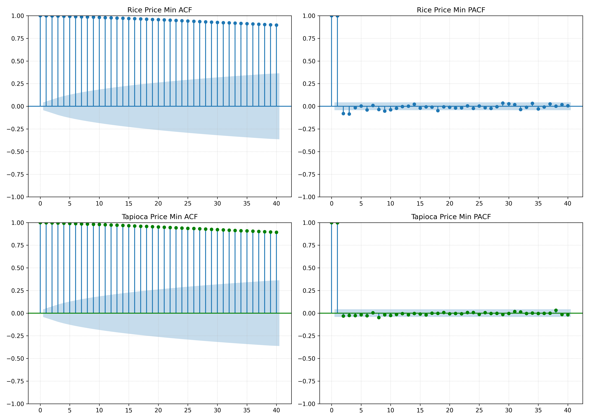  
*Figure 1: Mean ACF (blue) and PACF (orange) in levels over 40 lags for each of the twelve product groups with active series, ordered by persistence; the grey line repeats the cross-group mean ACF in every panel as a common reference, and n is the number of active series averaged. Every group shows the same single-spike PACF; the groups differ only in how fast the ACF decays.*

The signature is canonical unit-root behavior, and it is universal. In **every** group the PACF collapses to a single dominant spike at lag one and is negligible thereafter, meaning that once yesterday's price is known, earlier history adds essentially nothing. The series are first-order autoregressive with a near-unit root. Tomorrow's price is, to first order, today's price plus noise. What distinguishes the groups is only the *rate* of ACF decay, which spans a wide and economically coherent range: storable and administered commodities exhibit minimal decay (Feed & Raw Materials 0.92 at a 40-business-day lag; wholesale and retail rice, oil crops, meat, and field crops all 0.84–0.87), whereas short-cycle perishables mean-revert fastest (Fresh Vegetables 0.39, Fruits 0.52, Aquatic & Marine 0.59), with the cross-group mean still elevated at 0.75. Storability and administered pricing, not market size, govern persistence. This spread previews the stationarity gradient quantified in Section 3.5, while the shared lag-1 structure anticipates two results of Section 5: the Lag-1 persistence baseline is exceptionally difficult to outperform at short horizons, and per-product ARIMA, which fits exactly this lag structure, collapses onto that baseline almost identically.

### 3.4. Long-Term Price Trends

Figure 2 tracks monthly mean prices of the six largest product groups, with each product indexed to its own 2018 average so that heterogeneous price levels share one axis.

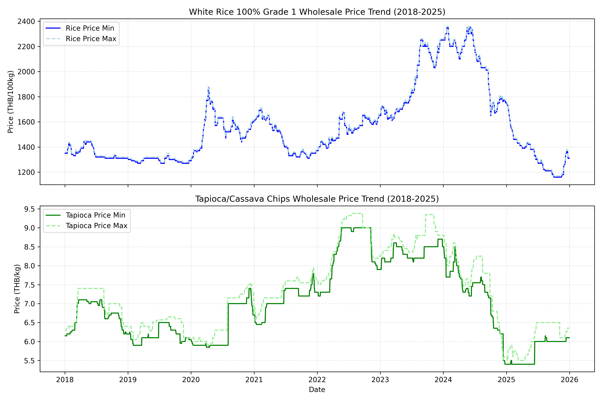  
*Figure 2: Indexed (2018 = 100) monthly mean price trajectories of the six largest product groups, showing heterogeneous long-term drift and volatility regimes.*

Common macro shocks and group-specific regimes coexist. The 2022 cost shock lifts nearly every group, and oil crops approach +80% over the period with a second run-up through 2025; meat and poultry settle roughly 50% above their 2018 level. Wholesale rice is the structural outlier, ending 2025 at or below its 2018 level after a sustained two-year decline. A single shared dynamic cannot describe these trajectories, motivating the entity- and group-conditioned pooling of Section 4, while the shared shock structure is what a pooled model can transfer across products.

### 3.5. Stationarity Analysis

We formalize the unit-root evidence with Augmented Dickey-Fuller (ADF) tests in levels on every active minimum- and maximum-price series. Overall, only **30.9%** (minimum price) and **28.8%** (maximum price) of the 635 active series reject the unit root at $p < 0.05$. The dataset is predominantly non-stationary, and models must handle trend-drift and structural shifts without producing spurious regressions. Table 2 splits the rates by market category and Figure 3 by product group.

#### Table 2: Stationarity Profiles by Market Category (ADF, p < 0.05, levels)
| Category | Active Series | Stationary Minimum Price (%) | Stationary Maximum Price (%) |
|---|---|---|---|
| Retail | 269 | 35.7% | 33.1% |
| Wholesale | 366 | 27.3% | 25.7% |

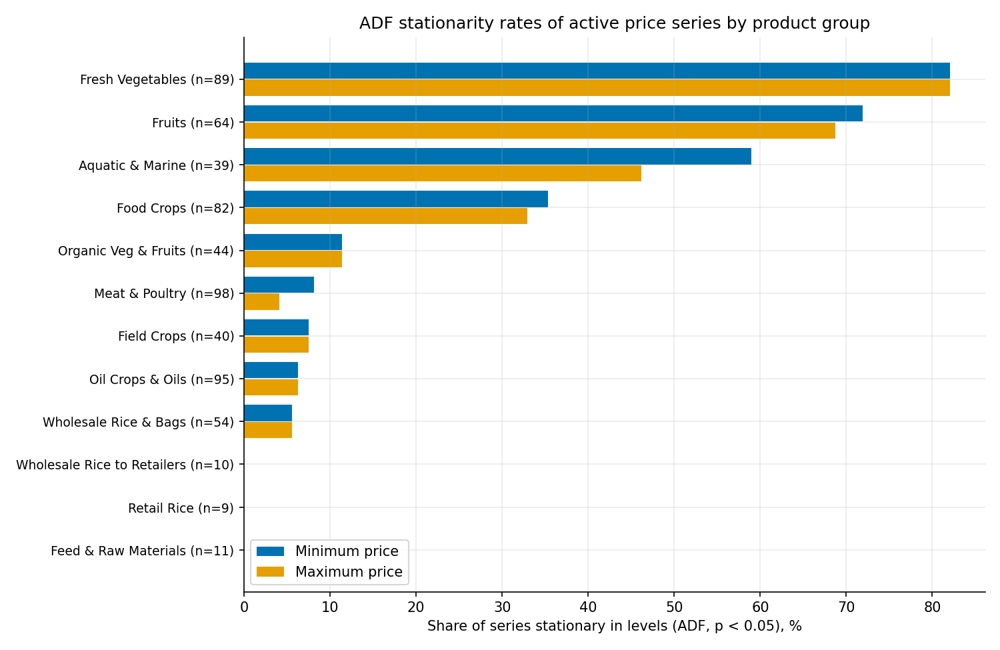  
*Figure 3: ADF stationarity rates for active minimum and maximum price series by product group. Thai group names are translated to concise English labels for publication readability; n denotes the number of active series.*

Two patterns stand out. First, retail series are consistently more mean-reverting than wholesale series (35.7% vs 27.3% on minimum prices). Consumer-end price stickiness produces mean reversion, while wholesale prices track long supply trends. Second, the group-level heterogeneity is extreme. Stationarity concentrates almost entirely in short-cycle perishables (Fresh Vegetables 82%, Fruits 72%, Aquatic & Marine 59%), whose cultivation and spoilage cycles force prices back to seasonal norms, while storable and administered products (rice in every form, oil crops, livestock, feed) are almost uniformly non-stationary (0–8%). No single statistical treatment fits both regimes, which is precisely the case for conditioning a shared model on group identity.

### 3.6. Cross-Product Co-Movement

Finally, we quantify market integration across the modelling universe. Over all 81,406 product pairs in the 404-crop universe, co-movement is **weak on average**. The mean pairwise correlation of price levels is only **0.180** (median 0.176), and just **14.3%** of pairs exceed 0.5. In daily *returns* it effectively vanishes, with a mean of **0.012** across all pairs and **−0.001** between products of different groups. Integration is concentrated rather than broad. Within a commodity group, level correlation rises to 0.357 (returns 0.091), against 0.152 (returns −0.001) across groups.

Figure 4 makes the concentration visible by zooming in on its extreme, the 40 most liquid series, which are dominated by internationally traded rubber, palm, cassava, and grain contracts.

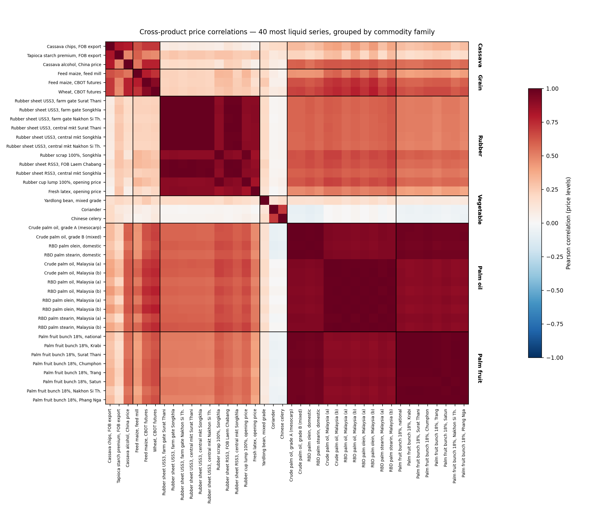  
*Figure 4: Pairwise Pearson correlation of price levels for the 40 most liquid series, ordered by commodity family (families annotated by the authors from the product names; the dataset's own grouping assigns rubber, cassava, and grain alike to "Field Crops"). This panel deliberately depicts the most integrated segment of the dataset; the near-unit blocks are largely one commodity priced at several grades, provinces, or delivery points, and it is not representative of the 404-crop universe, whose average correlation is 0.180.*

Within these families the correlation is near-mechanical (mean **0.940** in levels). The rubber block is a single USS3/RSS3 sheet grade quoted at three provinces and two market levels, and the palm block is crude, RBD, olein and stearin variants of one oil complex plus fresh fruit bunches priced by province. Even here, cross-family correlation falls to 0.481 in levels and **0.037** in returns. Grains and rubber share a slow trend, not a daily shock.

Two conclusions follow, and together they frame the rest of the paper. First, the pooling argument cannot rest on correlated prices. At 0.18 average level correlation and approximately 0.01 return correlation, there is essentially no cross-sectional signal to exploit, which is precisely why no pooled model in Section 5 improves on persistence at short horizons. What a global model can share instead is the *functional form* of the dynamics (the mean-reversion, seasonal, and volatility structure common to agricultural prices) plus direct transfer among the related series that do co-move (0.36 within group, 0.94 among near-duplicates). Second, what integration exists lives entirely in slow trends rather than daily shocks, which is why the pooled advantage in Section 5 appears only as the horizon lengthens.

In summary, the exploratory analysis yields four modeling prescriptions: (i) treat zero prices and outliers before any model sees the data; (ii) filter economically inactive listings, since near-constant series inflate the apparent accuracy of every forecaster; (iii) expect persistence to dominate short horizons, since the data contain neither the autocorrelation structure nor the cross-sectional co-movement needed to outperform it there, and design the objective accordingly rather than against it; and (iv) pool across products for shared dynamics and long-horizon trend structure, while conditioning on product and group identity to absorb the extreme heterogeneity in drift, mean reversion, and price level.

<!-- supplement-only-end -->
<!-- set-table-counter:2 -->

## 4. Methodology

### 4.1. Forecasting Horizons and Evaluation Metrics
We establish a multi-scale forecasting horizon aligned with agricultural decision cycles. Given the input sequence, models forecast at specific future steps:
*   $t+20$: One business month / 20 business days.
*   $t+60$: Three business months / 60 business days.
*   $t+120$: Six business months / 120 business days.
*   $t+250$: One business year / 250 business days.

Performance is measured using Mean Absolute Error (MAE), Root Mean Squared Error (RMSE), and Symmetric Mean Absolute Percentage Error (SMAPE), calculated as:

$$\text{MAE} = \frac{1}{N} \sum_{i=1}^{N} |y_i - \hat{y}_i|$$

$$\text{RMSE} = \sqrt{\frac{1}{N} \sum_{i=1}^{N} (y_i - \hat{y}_i)^2}$$

$$\text{SMAPE} = \frac{100\%}{N} \sum_{i=1}^{N} \frac{|y_i - \hat{y}_i|}{(|y_i| + |\hat{y}_i|)/2}$$

where $y_i$ represents the actual price and $\hat{y}_i$ represents the predicted price. For every quantile-regression TFT in this study (Section 4.4, item 5), $\hat{y}_i$ is the network's median (0.5 quantile) output, $\hat{y}^{med}_i$ in the notation of Section 4.7; the 0.1 and 0.9 quantile heads contribute only to the prediction intervals of Section 7 and never to the point-forecast metrics reported in Tables 5 through 8. For the non-quantile reference models of Section 4.3, $\hat{y}_i$ is each model's single point output.

### 4.2. Evaluation Protocol and Matched-Sample Comparison

All results follow a strict out-of-time protocol, summarized in Table 3. Model parameters are learned on labels through the end of 2022 over the pooled 404-crop dataset; the 2023 calendar year serves as the validation period for early stopping and for fitting all post-hoc calibration parameters; the 2024–2025 period is reserved exclusively for final evaluation. For every forecast origin in the test period, the model and the Lag-1 persistence baseline are evaluated on the *identical* window, with the persistence forecast defined as the final observed value of that window's encoder segment. This matched-sample design eliminates a subtle but serious failure mode in which model and baseline metrics are computed over different origin distributions and become incomparable. Each of the four reporting horizons is evaluated over 110,292 test windows (273 origins for each of the 404 crops); because every crop contributes an identical number of windows, the pooled average coincides exactly with the per-product macro-average. Validation-side fitting of calibration (and blend-variant) parameters uses, per horizon, every window whose label at that horizon falls within 2023 (12,120 windows at $t+20$ growing to 105,040 at $t+250$), so that even the longest horizon is fitted on a full year of labels rather than a small number of early-year origins.

#### Table 3: Chronological Data Partition and Its Role in the Protocol. Validation labels serve early stopping, decay-exponent selection, interval calibration, and blend-weight fitting; no test-period information enters any fitted quantity
| Partition | Period | Labels used for | Windows per horizon |
| :--- | :--- | :--- | :--- |
| Training | 2018–2022 | Parameter estimation (404 crops, pooled) | n/a |
| Validation | 2023 | Early stopping; selection; calibration | 12,120–105,040 |
| Test | 2024–2025 | Final evaluation only | 110,292 |

### 4.3. Baseline and Reference Models

We compare the proposed model against a suite of localized statistical benchmarks and global machine learning and deep learning references. The suite is constructed so that the comparisons of Section 5 isolate four distinct questions: whether any classical local rule, naive or fitted, is hard to beat (persistence, seasonal-naive, drift, and ARIMA), whether pooled learning over engineered features adds value without any sequence modeling (LightGBM), whether increasing architectural capacity adds value under identical inputs (MLP, gated recurrent networks, and a standard Transformer), and whether large-scale pretraining on heterogeneous time series substitutes for in-domain training (a zero-shot foundation model). All learned references share the conditions described below, so that differences in Table 5 are attributable to model class rather than to data, features, or evaluation.

Every in-domain learned reference uses the same leakage-safe price-lag, return, rolling-statistic, repricing, calendar, and entity features and is fitted through 2023 before evaluation on the identical 2024–2025 windows. LightGBM uses direct horizon-specific regression; the MLP, LSTM, and Transformer use joint multi-output regression; ARIMA is fitted per product; and Chronos-Bolt-Base is evaluated zero-shot from up to 512 prior observations. Detailed equations, configurations, and a ten-candidate validation search for each learned reference are provided in the Supplementary Material. Table 5 retains the original configurations, while the supplement shows that no validation-selected alternative beats persistence overall or approaches the selected TFT.

For the primary selected-TFT comparison, overlapping daily origins preclude treating window errors as independent. We therefore average the absolute-error differential within each product and apply a two-sided one-sample t-test and Wilcoxon signed-rank test to the 404 product means. Holm's procedure controls the four horizon-wise tests separately for each test family; the pre-specified overall contrast is reported separately. Mean cross-product return correlation is low, but residual dependence among near-duplicate products remains a limitation.

<!-- supplement-only-start -->

**Common feature representation.** Every learned reference model consumes the same engineered, leakage-safe representation of 51 price-derived and calendar predictors per forecast origin: twelve price lags spanning 1 to 250 business days; six differences and six returns over windows of 1 to 250 days; fourteen rolling statistics (means, standard deviations, medians, extrema, range, and coefficient of variation over 7- to 120-day windows); four repricing-activity counters (days since the last price change and change counts over 20, 60, and 250 days); and nine calendar coordinates (month, weekday, day of year, and their sine/cosine encodings). Every feature is computed strictly from prices available at or before the forecast origin, so no feature contains label information. Global models additionally receive integer-encoded product, category, and group identifiers.

**Common training and evaluation conditions.** Reference models are fitted on all data through the end of 2023, the union of the proposed model's training (2018–2022) and validation (2023) periods, so every competitor receives at least as much historical data as the TFT. Evaluation follows the matched-window protocol of Section 4.2 on identical 2024–2025 test windows. Multi-horizon prediction follows the strategy natural to each model class: recursive forecasting for ARIMA, direct forecasting (one independently trained model per horizon) for LightGBM, and joint multi-output regression for the neural networks. For the neural models, continuous inputs are standardized and targets are standardized during training, with predictions transformed back to price units for evaluation. As a final safeguard, any non-finite prediction is replaced by the persistence value for that window, a conservative rule that can only improve a competitor's measured accuracy. The evaluation pipeline also covers local per-product variants of each learned model and a random-forest reference in both paradigms; none of these outperforms the naive baseline overall, and none alters any conclusion of Section 5, so Table 5 reports the global variants consistent with the pooled-modeling focus of this study. To test sensitivity to configuration choice, the Supplementary Material gives each learned reference class a ten-configuration validation search, matching the exploratory TFT *architecture*-search budget while disclosing the separate seventeen-point loss sweep in full. Table 5 retains the original configurations used in the primary comparison; the supplement reports both those reruns and the validation-selected alternatives. No validation-selected reference outperforms persistence overall or approaches the proposed model, so the conclusion is insensitive to reference-model tuning at this budget.

1. **Lag-1 Persistence Baseline:**
   The Lag-1 persistence baseline issues the naive forecast of a random walk, carrying the most recently observed price forward to every horizon:
   $$\hat{y}_{t+h} = y_t, \quad h \in \{20, 60, 120, 250\}$$
   Its status as a benchmark is theoretically grounded. Under a martingale, the conditional expectation of any future price equals the current price, making persistence the minimum mean-squared-error forecast; with conditionally symmetric increments it is also the conditional median and therefore minimizes expected absolute error. These conditions are benchmarks rather than assumptions proved for every crop. The autocorrelation evidence of Section 3.3 nevertheless places many series close to a persistence-dominated regime, making this zero-parameter rule the most demanding reference in the study. It also serves as the fallback forecast throughout the pipeline.

2. **Seasonal-Naive and Drift:**
   Two further zero-parameter classical rules that a horizon-weighted result must survive. Seasonal-naive repeats the price observed exactly one full decoder cycle (250 business days, approximately one year) before the target, $\hat{y}_{t+h} = y_{t+h-250}$, always a known quantity at the forecast origin since $h \le 250$; it targets the annual crop cycles documented in Section 3.4 directly, at the cost of ignoring everything between. Drift extrapolates the straight line through the first and last observed prices of each series' history up to the origin, $\hat{y}_{t+h} = y_t + h \cdot (y_t - y_1)/t$, the classical alternative to persistence when a trend is suspected [16]. Both are included specifically because they are strong long-horizon competitors on seasonal or trending series, and Section 5.1 confirms neither threatens Lag-1 persistence on this dataset.

3. **Local ARIMA:**
   An $\text{ARIMA}(1, 1, 0)$ specification is fitted independently to each of the 404 crop price series by state-space maximum likelihood. The order is chosen to mirror the empirical lag structure documented in Section 3.3, a unit root plus a single partial-autocorrelation spike at lag one:
   $$\Delta y_t = c + \phi_1 \Delta y_{t-1} + \epsilon_t$$
   where $\Delta$ is the first-difference operator, $\phi_1$ the autoregressive coefficient, and $\epsilon_t$ white noise. Multi-step forecasts are generated recursively from every test origin through the Kalman filter, and any series whose estimation fails to converge falls back to persistence. The forecast function makes the near-identity with persistence in Table 5 interpretable rather than surprising: iterating the recursion gives $\hat{y}_{t+h} = y_t + \phi_1 \frac{1 - \phi_1^h}{1 - \phi_1} \Delta y_t$ (for $c = 0$), which flattens within a few steps at a level differing from $y_t$ by at most $\frac{\phi_1}{1-\phi_1} \Delta y_t$. Because the levels are near-unit-root first-order autoregressive (Section 3.3), the differenced series is close to white noise, the estimated $\phi_1$ is small, and the forecast is numerically indistinguishable from the naive rule at every reporting horizon. Its linear assumptions and inability to share parameters across series further limit its capacity to model non-linear price transmission.

4. **Global MLP:**
   A feedforward network trained on the pooled cross-section of all 404 crops. Entity information enters through learned embeddings (a 16-dimensional product embedding, 8-dimensional category and group embeddings, and 4-dimensional month and weekday embeddings), which are concatenated with the 49 standardized continuous features into a single input vector. Two fully connected hidden layers of 128 and 64 ReLU units, each followed by dropout of 0.47, map this vector to a joint multi-output regression head covering all forecast horizons simultaneously. Training minimizes mean squared error with Adam (learning rate $3.4 \times 10^{-3}$, batch size 4,096, five epochs). The MLP isolates whether pooled non-linear regression on the engineered features, with no sequential inductive bias whatsoever, can extract structure that the persistence rule misses.

5. **Global LightGBM:**
   LightGBM [3] is an optimized gradient-boosted decision tree (GBDT) framework. We use direct forecasting with one independently trained booster per horizon $h \in \{20, 60, 120, 250\}$, which avoids the error accumulation of recursive strategies at long horizons. Each booster is an additive ensemble of 100 leaf-wise trees trained with an L2 objective (learning rate 0.05, up to 2,633 leaves at a maximum depth of 8, a minimum of 700 observations per leaf, feature subsampling of 0.99, and bagging fraction 0.74 applied every third iteration). Product, category, group, month, and weekday enter through LightGBM's native categorical-split handling rather than through embeddings. GBDT ensembles are consistently strong learners on engineered tabular features, and Section 5.1 confirms this reference as the strongest learned alternative to the proposed model.

6. **Global LSTM and GRU:**
   Single-layer gated recurrent networks with a 16-dimensional hidden state, trained globally across all commodities with the same entity embeddings and standardized continuous inputs as the MLP and the same joint multi-output head, optimized with Adam (learning rate 0.01, batch size 4,096, three epochs). In this design the sequential history enters through the engineered lag and rolling-window features, so the gated cells act as learned non-linear filters over that representation. Unlike the TFT, these architectures possess neither self-attention nor variable selection networks, forcing them to process all input variables uniformly. Table 5 reports the LSTM; the GRU variant performs comparably (53.82 THB overall MAE against the LSTM's 59.59) and, like every omitted reference variant, does not outperform the naive baseline overall.

7. **Standard Transformer:** The standard Transformer reference [6] applies an encoder of two multi-head self-attention layers (four heads, model width $d_{model} = 32$, feed-forward width 128, dropout 0.1) to a six-token input in which the projected continuous feature vector and the five entity and calendar embeddings each constitute one token:
   $$\text{head}_h = \text{Softmax}\left(\frac{\mathbf{Q}_h \mathbf{K}_h^T}{\sqrt{d_k}}\right)\mathbf{V}_h$$
   followed by position-wise feed-forward layers, residual connections, and layer normalization; the flattened encoder output feeds the same joint multi-output head as the other neural references (Adam, learning rate $3 \times 10^{-3}$, batch size 4,096, five epochs). This model serves as the unstructured high-capacity control and tests whether attention capacity without the TFT's variable-selection and static-conditioning structure is sufficient on these noisy series.

8. **Zero-Shot Foundation Model:**
   Chronos-Bolt-Base [10] is a pretrained probabilistic time-series foundation model, included to test whether large-scale pretraining on heterogeneous public time series substitutes for the in-domain training every other reference receives. It is evaluated zero-shot: no fine-tuning, no exposure to this dataset during pretraining, and the same test windows as every other row of Table 5. Each forecast conditions on up to 512 business days of that product's own price history immediately preceding the origin (the model's practical context limit; encoder histories shorter than 512 days use whatever history is available), predicts 250 steps ahead, and reports the median of the predictive distribution at each reporting horizon.

**Significance testing.** For the primary selected-model comparison against the matched baseline, we test whether observed MAE differences are distinguishable from zero. A standard time-series Diebold-Mariano test [17] is unsuitable here: forecasts from consecutive daily origins at a fixed horizon overlap by construction, and at $h=250$ the 273 test-period origins per crop contain little independent temporal information. We instead use product-level analysis units. For every crop we collapse its per-window absolute-error differentials (selected model minus baseline) to one mean value, yielding 404 product means; the near-zero average cross-product return correlation documented in Section 3.6 supports this approximation, while the limitations discuss the remaining within-family dependence. We report a two-sided one-sample t-test and a Wilcoxon signed-rank test on these product means, per horizon and overall. Because four horizon-wise hypotheses are examined, we apply Holm's step-down correction separately to each four-test family (t and Wilcoxon); the overall comparison is the pre-specified aggregate contrast and is reported separately.

<!-- supplement-only-end -->

### 4.4. Temporal Fusion Transformer Architecture

The Temporal Fusion Transformer (TFT) architecture integrates static metadata and multi-scale sequential covariates using specialized neural blocks. The network is optimized end-to-end to generate multi-horizon probabilistic forecasts. All inputs to the TFT in our experiments are strictly price-derived (the historical target series) plus deterministic calendar covariates and categorical metadata (product, category, and market group IDs).

Information flows through the network as follows. Static metadata is mapped to entity embeddings and then to context vectors that condition downstream blocks. At each time step, a variable selection network weighs the available inputs; the selected representation passes through an LSTM encoder over the 30-day lookback window and an LSTM decoder over the 250-step forecast window, both initialized from static context. Gated skip connections and interpretable multi-head self-attention enrich the decoder states, and linear quantile heads emit the 10th, 50th, and 90th percentile forecasts at every decoder step under the horizon-weighted loss of Section 4.5. Table 4 consolidates the configuration.

The Supplementary Material gives the GRN, VSN, LSTM, shared-value attention, and pinball-loss equations. In the interpretable attention block, query and key projections are head-specific, the value projection is shared, and head attention matrices are averaged [7].

<!-- supplement-only-start -->

#### 1. Gated Residual Networks (GRN) and GLU
To adaptively allocate model capacity and filter out noise from weak predictors, the TFT uses Gated Residual Networks (GRN) as its primary building blocks. Given an input vector $\mathbf{a} \in \mathbb{R}^{d_{in}}$ and an optional static context vector $\mathbf{c} \in \mathbb{R}^{d_{context}}$, the GRN is formulated as:
$$\text{GRN}_{d_{out}}(\mathbf{a}, \mathbf{c}) = \text{LayerNorm}(\mathbf{a} + \text{GLU}_{d_{out}}(\mathbf{\eta}_1))$$
where the gating mechanism is governed by a Gated Linear Unit (GLU):
$$\text{GLU}_{d_{out}}(\mathbf{\gamma}) = \sigma(\mathbf{W}_4 \mathbf{\gamma} + \mathbf{b}_4) \odot (\mathbf{W}_5 \mathbf{\gamma} + \mathbf{b}_5)$$
and the intermediate activations are defined as:
$$\mathbf{\eta}_1 = \mathbf{W}_1 \mathbf{\eta}_2 + \mathbf{b}_1$$
$$\mathbf{\eta}_2 = \text{ELU}(\mathbf{W}_2 \mathbf{a} + \mathbf{W}_3 \mathbf{c} + \mathbf{b}_2)$$
Here, $\text{ELU}$ is the Exponential Linear Unit activation, $\sigma$ is the sigmoid function, $\odot$ represents the Hadamard product, and $\mathbf{W}_i, \mathbf{b}_i$ are learnable weights and biases. When a feature contains mostly noise, the GLU's sigmoid gate suppresses the non-linear path, reverting the GRN to a simple linear mapping, which directly mitigates architectural saturation.

#### 2. Variable Selection Networks (VSN)
At each time step, a VSN acts as an active information filter, dynamically identifying the most relevant features. For a set of $M$ variables $\mathbf{x}_t = [\mathbf{x}_t^{(1)}, \dots, \mathbf{x}_t^{(M)}]^T$, the network computes variable selection weights $\mathbf{v}_t \in \mathbb{R}^M$:
$$\mathbf{v}_t = \text{Softmax}(\text{GRN}_{v}(\mathbf{g}_t, \mathbf{c}))$$
where $\mathbf{g}_t = [(\tilde{\mathbf{x}}_t^{(1)})^T, \dots, (\tilde{\mathbf{x}}_t^{(M)})^T]^T$ is the concatenated representation of all variables projected into $d_{model}$-dimensional spaces via independent GRNs:
$$\tilde{\mathbf{x}}_t^{(j)} = \text{GRN}_{x,j}(\mathbf{x}_t^{(j)})$$
The final selected feature vector is a weighted sum:
$$\tilde{\mathbf{x}}_t = \sum_{j=1}^{M} v_t^{(j)} \tilde{\mathbf{x}}_t^{(j)}$$
This allows the model to isolate and prioritize high-signal features (like immediate lags) and completely ignore noisy inputs.

#### 3. LSTM Sequence Encoder/Decoder
The selected features are passed into a sequence-to-sequence layer for local context processing. An LSTM encoder processes the historical lookback window ($k = 30$ business days), and an LSTM decoder processes the full 250-step forecast window from which the reporting horizons $h \in \{20, 60, 120, 250\}$ are read. The recurrent states are initialized from static context vectors:
$$\mathbf{h}_0 = \mathbf{c}_h, \quad \mathbf{c}_0 = \mathbf{c}_c$$
where $\mathbf{h}_0$ is the initial hidden state, $\mathbf{c}_0$ is the initial cell state, and $\mathbf{c}_h, \mathbf{c}_c$ are GRN outputs of the full static covariate vector (Section 4.5), allowing the recurrent layer to adapt its dynamics to the specific commodity.
The LSTM cell updates at time step $t$ are governed by the standard gating mechanisms:
$$\mathbf{f}_t = \sigma(\mathbf{W}_f [\mathbf{h}_{t-1}, \mathbf{x}_t] + \mathbf{b}_f)$$
$$\mathbf{i}_t = \sigma(\mathbf{W}_i [\mathbf{h}_{t-1}, \mathbf{x}_t] + \mathbf{b}_i)$$
$$\tilde{\mathbf{c}}_t = \tanh(\mathbf{W}_c [\mathbf{h}_{t-1}, \mathbf{x}_t] + \mathbf{b}_c)$$
$$\mathbf{c}_t = \mathbf{f}_t \odot \mathbf{c}_{t-1} + \mathbf{i}_t \odot \tilde{\mathbf{c}}_t$$
$$\mathbf{o}_t = \sigma(\mathbf{W}_o [\mathbf{h}_{t-1}, \mathbf{x}_t] + \mathbf{b}_o)$$
$$\mathbf{h}_t = \mathbf{o}_t \odot \tanh(\mathbf{c}_t)$$
where $\mathbf{f}_t, \mathbf{i}_t, \mathbf{o}_t$ represent the forget, input, and output gates, $\mathbf{c}_t$ is the cell state, and $\mathbf{h}_t$ is the hidden state.

#### 4. Interpretable Multi-Head Self-Attention
To capture long-term sequential dependencies, the TFT uses interpretable multi-head self-attention [7]. Each head has its own query and key projections but all heads share one value projection; the head-specific attention matrices are then averaged:
$$\mathbf{A}_m = \text{Softmax}\left(\frac{(\mathbf{Q}\mathbf{W}_{Q}^{(m)})(\mathbf{K}\mathbf{W}_{K}^{(m)})^T}{\sqrt{d_{attn}}}\right), \qquad
\tilde{\mathbf{A}}=\frac{1}{M}\sum_{m=1}^{M}\mathbf{A}_m,$$
$$\text{InterpretableMultiHead}(\mathbf{Q},\mathbf{K},\mathbf{V})
=\tilde{\mathbf{A}}\,\mathbf{V}\mathbf{W}_{V}\mathbf{W}_{O},$$
where $\mathbf{W}_{V}$ is shared across heads and $\mathbf{W}_{Q}^{(m)},\mathbf{W}_{K}^{(m)}$ are head-specific. The averaged matrix $\tilde{\mathbf{A}}$ supports a common temporal-importance summary across heads; it is a model diagnostic, not proof that attended steps are causal.

#### 5. Quantile Loss Function
To generate probabilistic intervals rather than simple point predictions, the model is optimized using joint quantile regression. For target quantiles $\mathcal{Q} = \{0.1, 0.5, 0.9\}$ (defining an 80% prediction interval around the median), the Quantile Loss is formulated as:
$$\mathcal{L}(\Omega) = \sum_{y \in \Omega} \sum_{q \in \mathcal{Q}} \sum_{t=1}^T \rho_q (y_t - \hat{y}_{t, q})$$
where $\rho_q(e)$ is the pinball loss function:
$$\rho_q(e) = e(q - \mathbb{I}_{\{e < 0\}})$$

<!-- supplement-only-end -->

#### 6. Training Configuration and Hyperparameters
Table 4 consolidates the complete configuration, which is identical for every TFT in this study; the decay exponent $\gamma$ of the loss function (Section 4.6) is the only quantity varied across experiments, so that any performance difference in Section 5.2 is attributable to the loss geometry alone. All experiments are conducted globally over the pooled crop dataset with a fixed random initialization per run and are accelerated with PyTorch and CUDA on dedicated GPU hardware (NVIDIA RTX series). The full training and evaluation pipeline, including per-run artifacts (metrics, per-sample predictions, and model checkpoints), is reproducible from the accompanying code.

#### Table 4: Temporal Fusion Transformer Configuration (identical across all experiments)
| Component | Setting |
| :--- | :--- |
| Encoder (lookback) length | 30 business days |
| Decoder (forecast) length | 250 business days; reporting horizons $t+20$, $t+60$, $t+120$, $t+250$ |
| Hidden state size | 64 |
| Attention heads | 4 |
| Continuous-variable encoding size | 8 |
| Dropout | 0.1 |
| Output quantiles | $\{0.1, 0.5, 0.9\}$ |
| Target normalization | Per-product group normalizer, softplus transformation |
| Loss function | Horizon-Weighted Quantile Loss, $w(h) = 1/h^\gamma$ (Section 4.6) |
| Optimizer | Adam, learning rate 0.01, reduce-on-plateau schedule (patience 4) |
| Batch size | 64 (training), 128 (inference) |
| Gradient clipping | 0.1 |
| Epoch budget | 5, with early stopping on validation loss (patience 5, min. delta $10^{-4}$) |

<!-- supplement-only-start -->

### 4.5. Cross-Product Representation Learning and Static Covariate Encoders

A primary challenge of global forecasting across heterogeneous price series is capturing product-specific characteristics without parameter bloat. The TFT resolves this through cross-product representation learning. First, categorical metadata variables representing the product ($p \in \mathcal{P}$), category ($c \in \mathcal{C}$), and group ($g \in \mathcal{G}$) are mapped to low-dimensional continuous vector embeddings:
$$\mathbf{e}_p = \mathbf{W}_p \mathbf{x}_p, \quad \mathbf{e}_c = \mathbf{W}_c \mathbf{x}_c, \quad \mathbf{e}_g = \mathbf{W}_g \mathbf{x}_g$$
where $\mathbf{x}_p, \mathbf{x}_c, \mathbf{x}_g$ are one-hot encoded vectors, and $\mathbf{W}_p \in \mathbb{R}^{d \times |\mathcal{P}|}$, $\mathbf{W}_c \in \mathbb{R}^{d \times |\mathcal{C}|}$, $\mathbf{W}_g \in \mathbb{R}^{d \times |\mathcal{G}|}$ are learnable embedding matrices.

These static embeddings are concatenated to form the static covariate representation:
$$\mathbf{s} = [\mathbf{e}_p^T, \mathbf{e}_c^T, \mathbf{e}_g^T]^T$$
The static vector $\mathbf{s}$ is then passed through four independent Gated Residual Networks to generate specialized static context vectors:
$$\mathbf{c}_s = \text{GRN}_s(\mathbf{s}), \quad \mathbf{c}_e = \text{GRN}_e(\mathbf{s}), \quad \mathbf{c}_c = \text{GRN}_c(\mathbf{s}), \quad \mathbf{c}_h = \text{GRN}_h(\mathbf{s})$$
These context vectors integrate the static metadata directly into the sequence-to-sequence networks:
*   $\mathbf{c}_s$ conditions the variable selection network (VSN) for input features.
*   $\mathbf{c}_c$ and $\mathbf{c}_h$ initialize the cell state ($\mathbf{c}_0$) and hidden state ($\mathbf{h}_0$) of the LSTM sequence encoder and decoder:
    $$\mathbf{c}_0 = \mathbf{c}_c, \quad \mathbf{h}_0 = \mathbf{c}_h$$
*   $\mathbf{c}_e$ modulates the intermediate sequential representations before the self-attention layer.

This static covariate encoding structure allows the global model to construct a shared representational space for general price dynamics (e.g. macro-economic cycles) while utilizing static context vectors to customize the model's behavior for each individual crop.

<!-- supplement-only-end -->
<!-- set-subsection-counter:5 -->

### 4.6. Horizon Allocation and the Horizon-Weighted Quantile Loss

A standard joint decoder objective averages losses uniformly over all 250 forecast steps. Uniform per-step weighting is not neutral when the application values a small set of decision horizons: 230 of the 250 terms lie beyond the first business month, and expected forecast loss generally grows with horizon. The resulting objective therefore allocates most of its total loss mass to a long block of distant steps, even though early and distant steps can favor different parameter updates.

This statement concerns *loss allocation*, not a directly measured increase in per-residual gradient magnitude. For pinball loss $\rho_q(u)=u(q-\mathbb{1}\{u<0\})$, the subgradient with respect to the prediction is bounded:
$$\frac{\partial \rho_q(y-\hat y)}{\partial \hat y} =
\begin{cases}
-q, & y>\hat y,\\
1-q, & y<\hat y.
\end{cases}$$
Its magnitude does not grow with the absolute residual. We therefore do not infer gradient dominance merely from larger far-horizon errors, nor do we measure gradient-vector conflict directly. Instead, we test the narrower empirical hypothesis that explicitly reallocating the joint objective across decoder steps changes the multi-horizon accuracy trade-off.

We apply a step-dependent weight $w(h)$ to the quantile loss at every decoder step:
$$\mathcal{L}_{HW\text{-}Quantile} = \sum_{h=1}^{H} w(h) \cdot \mathcal{L}_{Quantile}(y_{pred, t+h}, y_{true, t+h})$$

We parameterize the loss decay weighting function using a 1-parameter power-law family:
$$w(h) = \frac{1}{h^\gamma}$$
where $\gamma \ge 0$ controls how rapidly loss contributions from later decoder steps are discounted.

We adopt a power-law family for three reasons. First, a single-exponent power law is scale-free: rescaling the horizon by a constant rescales all weights by a common factor, whereas an exponential schedule introduces an additional characteristic decay horizon. Second, it provides a one-parameter path from the unweighted objective ($\gamma=0$) to increasingly early-focused training. This fixed modulation is analogous in spirit to focal reweighting [18] and is simpler to audit than adaptive multi-task schemes such as GradNorm [19]. Third, under a zero-drift random walk, persistence error has variance $\text{Var}(y_{t+h}-y_t)=h\sigma^2$ [1], so expected absolute error and expected pinball-loss scale grow as $\mathcal{O}(\sqrt{h})$ under symmetric innovations. Thus $\gamma=0.5$ approximately normalizes the *expected loss scale* across horizons in that stylized case; it does not normalize the bounded pinball subgradient itself.

Under this formulation, we systematically evaluate seventeen decay exponents spanning $\gamma \in \{0.0, 0.5, \dots, 8.0\}$ in half-unit steps, ranging from the standard unweighted objective ($\gamma = 0$, $w(h) = 1$) through square-root, linear, and inverse-square decays to extreme early-step prioritization (at $\gamma = 8$ the weight on the 250th step is of order $10^{-20}$). Representative weight curves are shown in the Supplementary Material.

<!-- supplement-only-start -->
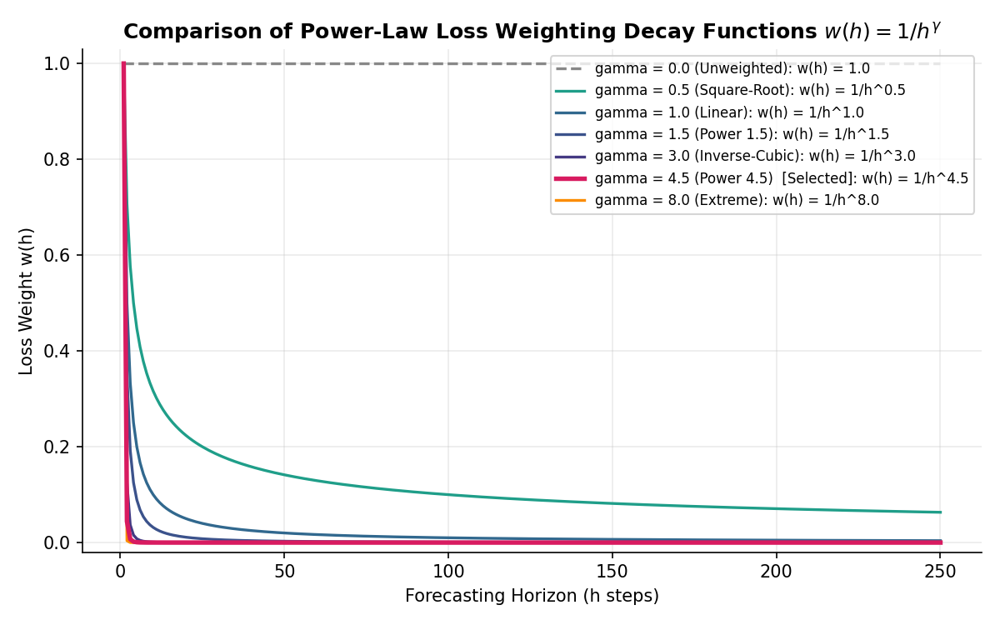
*Figure 5: Comparison of the unweighted objective and power-law schedules used to reallocate loss across decoder horizons.*
<!-- supplement-only-end -->

### 4.7. Model Selection, Seed Sensitivity, and Interval Calibration

**1. Model selection on validation.** The seventeen-point sweep uses seed 42 for every candidate. We select the decay exponent with the lowest mean MAE across the four reporting horizons on the 2023 validation year; $\gamma = 4.5$ is the minimum. Test metrics do not enter this formal selection rule. After fixing the exponent, we retrain it under seeds 43 and 44 as a sensitivity analysis rather than averaging seeds into the selection criterion. Across the three runs, overall test MAE ranges from 39.76 to 43.70 THB versus 45.21 THB for persistence; all three runs retain the $t+120$ and $t+250$ advantage. The selected seed-42 artifact supplies the primary tables, while the full multi-seed results are reported in the Supplementary Material.

**2. Validation-fitted conformal-style interval scaling.** Raw quantile intervals from pooled TFTs are systematically too narrow on this data, increasingly so at steep decay exponents whose vanishing far-future loss weights leave dispersion weakly supervised. Inspired by locally adaptive conformalized quantile regression [14], we rescale the 80% interval around the median by a per-horizon factor $s_h$, chosen as the empirical 80th percentile of the validation nonconformity scores
$$r_i = \max\!\left(\frac{\hat{y}^{med}_i - y_i}{\hat{y}^{med}_i - \hat{y}^{lo}_i}, \; \frac{y_i - \hat{y}^{med}_i}{\hat{y}^{hi}_i - \hat{y}^{med}_i}\right)$$
so that the scaled interval $[\hat{y}^{med} - s_h(\hat{y}^{med} - \hat{y}^{lo}), \; \hat{y}^{med} + s_h(\hat{y}^{hi} - \hat{y}^{med})]$ attains approximately nominal empirical coverage on validation. Scales are fitted per horizon on all windows whose horizon-$h$ label falls in 2023; no test-period information enters the scale. This is not a formal split-conformal construction: the same validation year also informs early-stopping monitoring and exponent selection, adjacent windows overlap, and temporal exchangeability is implausible. Accordingly, Section 7 reports empirical test coverage without a finite-sample guarantee.

**3. System variants for comparison.** Because forecast combination is the classical remedy for both training variance and near-term weakness [11,13], we also evaluate two variants: (i) a *gamma-ensemble* that averages the median forecasts of the moderate-decay members, $\hat{y}^{ens}_{t+h} = \frac{1}{|\Gamma|}\sum_{\gamma \in \Gamma} \hat{y}^{(\gamma)}_{t+h}$ with $\Gamma = \{0.0, 0.5, \dots, 3.0\}$ selected on validation; and (ii) a *persistence-anchored* blend $\hat{y}^{sys}_{t+h} = \alpha_h \hat{y}^{ens}_{t+h} + (1-\alpha_h) y_t$ with per-horizon convex weights fitted on 2023 validation MAE. Since $\alpha_h = 0$ recovers the baseline exactly, the anchored variant is never worse than persistence by construction on validation; its test behavior is reported in Section 5.3.

### 4.8. Target-Normalizer Staleness Diagnostic

The per-product `GroupNormalizer` is fitted on 2018–2022 and not refreshed. As an exploratory diagnostic, a raw-price proxy for the level shift from the training-period mean to the final 2023 observation exceeds 10% for 70.6% of products and correlates with relative $t+20$ error (Spearman $r=0.146$, unadjusted $p=0.007$). Because the proxy is not the transformed internal normalizer center and the association is not causal, full definitions, quartile results, and long-horizon correlations are placed in the Supplementary Material.

<!-- supplement-only-start -->

A structural property of the `GroupNormalizer` used to decode raw price units (Section 4.4) provides a second hypothesis for near-term error. The normalizer fits a per-product center and scale once from the 2018–2022 training window under the softplus transformation; it is not refit as the 2024–2025 evaluation period unfolds. When a product's price level has shifted since training, the frozen center can differ substantially from its level at the start of the test period.

We construct a raw-price proxy for this mismatch for every product in the 404-crop universe with sufficient price movement to admit a meaningful comparison (401 products): $\text{gap}_p = 100 \times (y_{p,last}^{2023} - \bar{y}_p^{train})/\bar{y}_p^{train}$, the percentage change from each product's 2018–2022 mean price to its final observed 2023 price before the test period. This is not the internal `GroupNormalizer` center, which is estimated after transformation, but it measures the same type of training-to-deployment level shift in interpretable price units. The absolute gap is large and pervasive: **70.6%** of products (283 of 401) exceed 10%, the mean is **30.4%**, the median **18.4%**, and the maximum 332%. Prices are higher at the end of 2023 than during training for 76% of products, consistent with the broad 2022–2023 inflation documented in Section 3.4.

The observed gaps are associated with, but do not by themselves prove, a decoding bias. We correlate each product's $|\text{gap}|$ with the selected model's relative error against persistence on the test set. At $t+20$ the correlation is positive (Spearman $r = +0.146$, $p = 0.007$), and the proportion of crops on which the selected model wins falls from 33.7% in the smallest-gap quartile to 13–22% in the larger-gap quartiles. At $t+120$ and $t+250$, the correlation reverses sign ($r = -0.206$ and $-0.188$, both $p < 0.001$). These exploratory, unadjusted associations are consistent with stale normalization being costly near term while persistence itself becomes less competitive at long horizons; they are not a causal identification. We therefore report normalizer staleness as a quantified limitation and leave controlled refitting or ablation to future work.

<!-- supplement-only-end -->

---

## 5. Quantitative Results

This section reports results in the order of the questions posed in Section 4.3. Section 5.1 establishes the reference comparison across model classes; Section 5.2 maps the effect of the decay exponent on accuracy and interval quality; Section 5.3 evaluates the validation-selected model against the matched baseline, including its temporal stability and the system variants; and Section 5.4 examines individual forecast trajectories qualitatively. All numbers follow the matched-window protocol of Section 4.2, and, unless stated otherwise, aggregate figures average the four reporting horizons over the full 2024–2025 test period.

### 5.1. Reference Benchmark Suite

Table 5 reports a broad model comparison across local statistical benchmarks, pooled global learners, and a zero-shot foundation model, all evaluated under the matched-window protocol of Section 4.2: the same 404 crops, the same 110,292 test windows per horizon, and the same baseline as every other table in this paper. The last two rows report a standard unweighted TFT control and the selected horizon-weighted model defined in Section 4.7.

Four patterns emerge. First, no classical local rule improves on persistence overall. ARIMA is numerically indistinguishable from it; seasonal-naive is substantially worse (70.19 THB overall); and drift is worse at every horizon beyond $t+20$ (49.90 THB overall). Second, the global MLP, LSTM, Transformer, and unweighted TFT are worse than persistence overall, whereas LightGBM is competitive (44.83 THB). Third, zero-shot Chronos-Bolt reaches 47.01 THB, competitive with but not better than persistence on this dataset. This is a result for one foundation-model checkpoint and zero-shot protocol, not a general claim about pretrained forecasters. Fourth, holding the TFT architecture, data, seed, and training budget fixed, horizon weighting changes its overall MAE from 72.85 to 39.76 THB and yields the best $t+120$ and $t+250$ values in Table 5. This controlled contrast is consistent with loss allocation being a key constraint in the unweighted TFT; it does not isolate every possible architecture or optimization explanation.

#### Table 5: Reference Suite Mean Absolute Error by Horizon (THB; matched-window protocol, 404 crops)
| Model | $t+20$ | $t+60$ | $t+120$ | $t+250$ | Overall |
| :--- | :---: | :---: | :---: | :---: | :---: |
| Lag-1 Persistence | **15.11** | **30.86** | 51.03 | 83.84 | 45.21 |
| Seasonal-Naive | 62.18 | 63.76 | 71.00 | 83.84 | 70.19 |
| Drift | 15.69 | 32.70 | 55.76 | 95.47 | 49.90 |
| ARIMA | 15.11 | 30.87 | 51.02 | 83.83 | 45.21 |
| Global LightGBM | 29.37 | 43.37 | 49.69 | 56.88 | 44.83 |
| Global MLP | 46.34 | 48.22 | 53.34 | 79.60 | 56.88 |
| Global LSTM | 50.68 | 51.43 | 56.65 | 79.60 | 59.59 |
| Global Transformer | 46.71 | 57.22 | 74.80 | 104.55 | 70.82 |
| Chronos-Bolt (zero-shot) | 16.85 | 33.85 | 53.37 | 83.98 | 47.01 |
| TFT | 69.74 | 76.37 | 73.94 | 71.37 | 72.85 |
| **Horizon-Weighted Quantile TFT (ours)** | 26.51 | 33.81 | **45.75** | **52.97** | **39.76** |

### 5.2. Loss Decay Exponent ($\gamma$) Sweep

Figure 6 plots horizon-specific and overall test MAE for one matched seed-42 run per exponent; the full numeric grid is in the Supplementary Material. High decay generally improves near-term accuracy relative to the unweighted objective, but the path is not monotone. Raw $t+20$ MAE falls from 69.74 THB at $\gamma=0$ to 23–30 THB for most $\gamma \ge 4$ (minimum 22.80 at $\gamma=6.5$), a reduction of up to **67%** under otherwise identical architecture, data, seed, and training budget. Overall test MAE occupies a broad but noisy low-error region of 39.76–48.63 THB for $\gamma \in [3,6]$; validation MAE selects $\gamma=4.5$. For $\gamma \in [6.5,8]$, one-year MAE is 67–71 THB, consistent with excessively weak far-horizon supervision. Because each grid point is a single run, fine-grained non-monotonic differences should not be read as a smooth dose-response curve.

<!-- supplement-only-start -->
#### Table 6: Raw Horizon-Weighted TFT Error by Decay Exponent (MAE THB / SMAPE, one seed-42 run per exponent)
| $\gamma$ | $t+20$ | $t+60$ | $t+120$ | $t+250$ | Overall MAE |
| :---: | :---: | :---: | :---: | :---: | :---: |
| 0.0 | 69.74 / 18.66% | 76.37 / 21.77% | 73.94 / 22.84% | 71.37 / 23.21% | 72.85 |
| 0.5 | 75.16 / 19.79% | 78.42 / 23.03% | 71.88 / 23.31% | 63.94 / 23.49% | 72.35 |
| 1.0 | 51.28 / 13.03% | 64.83 / 19.53% | 67.71 / 21.06% | 72.03 / 23.40% | 63.96 |
| 1.5 | 49.45 / 12.31% | 72.24 / 20.76% | 72.97 / 22.47% | 71.21 / 22.31% | 66.47 |
| 2.0 | 51.05 / 12.03% | 62.63 / 18.40% | 65.05 / 21.16% | 62.45 / 22.25% | 60.30 |
| 2.5 | 44.76 / 12.30% | 59.10 / 19.88% | 56.84 / 21.42% | 60.30 / 21.93% | 55.25 |
| 3.0 | 31.16 / 9.87% | 38.24 / 15.98% | **42.69 / 18.23%** | 57.63 / 18.55% | 42.43 |
| 3.5 | 45.02 / 10.98% | 50.74 / 18.27% | 50.83 / 20.11% | **47.92 / 18.77%** | 48.63 |
| 4.0 | 25.63 / 8.69% | 34.80 / 14.76% | 44.76 / 18.02% | 68.01 / 19.23% | 43.30 |
| 4.5 | 26.51 / 8.79% | **33.81 / 14.64%** | 45.75 / 17.98% | 52.97 / 18.29% | **39.76** |
| 5.0 | 29.11 / 9.16% | 36.16 / 15.02% | 43.96 / 18.77% | 63.66 / 21.33% | 43.22 |
| 5.5 | 27.30 / 9.20% | 36.53 / 15.15% | 44.09 / 18.11% | 60.35 / 18.96% | 42.07 |
| 6.0 | 29.82 / 9.58% | 41.54 / 16.12% | 45.99 / 18.71% | 52.75 / 18.48% | 42.53 |
| 6.5 | **22.80 / 8.82%** | 33.87 / 15.01% | 47.18 / 18.43% | 70.78 / 19.82% | 43.66 |
| 7.0 | 27.14 / 9.19% | 35.76 / 15.19% | 46.24 / 18.53% | 67.92 / 19.85% | 44.27 |
| 7.5 | 24.04 / 8.88% | 34.79 / 14.91% | 44.70 / 18.10% | 66.88 / 19.48% | 42.60 |
| 8.0 | 26.15 / 9.98% | 37.37 / 16.02% | 46.57 / 18.93% | 67.36 / 19.76% | 44.36 |
<!-- supplement-only-end -->
<!-- set-table-counter:6 -->
<!-- set-figure-counter:5 -->

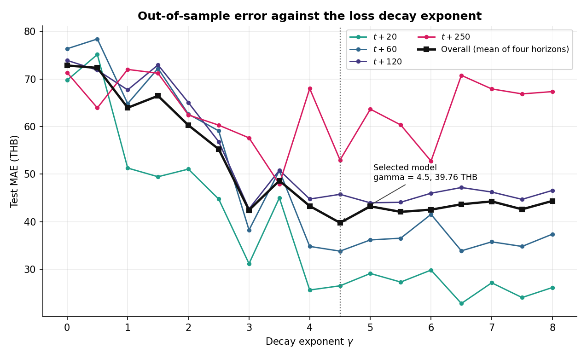
*Figure 6: Horizon-specific and overall test MAE across the power-law decay exponent grid, one seed-42 run per point. Per-column minima in Table 6 are bolded.*

Two properties of this region govern the choice of operating point. First, $\gamma = 4.5$ attains the lowest validation MAE of any swept exponent and is therefore selected (Section 4.7); its test performance is reported in Section 5.3. The three-seed sensitivity analysis gives overall MAE of 39.76, 42.22, and 43.70 THB, so the exact figure is initialization-dependent even though the aggregate and long-horizon ranking against persistence is stable across those runs.

Second, raw probabilistic quality generally deteriorates as decay becomes steep. Across horizons, raw 80% interval coverage ranges from 38–65% for the shallower members ($\gamma \le 3$) and reaches values as low as 6.3% for $\gamma \ge 6$. The association is not strictly monotone at every grid point, but it is consistent with weakly weighted outer quantile heads learning inadequate far-horizon spread. Operational use of the selected model therefore requires separately validated interval scaling; point accuracy alone does not justify its raw intervals.

### 5.3. Selected Model Performance

Table 7 reports the selected horizon-weighted TFT ($\gamma = 4.5$) against the matched Lag-1 baseline. It improves every aggregate metric: MAE by 12.0%, SMAPE by 0.7%, and RMSE by 15.1%. The gains are concentrated precisely where theory predicts: −10.3% MAE at six months and −36.8% at one year, as accumulated drift variance degrades the random-walk forecast. The trade-off is reported explicitly rather than obscured by the aggregates. The selected model remains behind the baseline at $t+20$ (26.51 vs 15.11 THB) and $t+60$ (33.81 vs 30.86 THB), where daily price changes are near-unpredictable and the persistence rule is close to optimal.

Every horizon-level difference in Table 7 is tested on the 404 product-level mean differentials using a one-sample t-test and Wilcoxon signed-rank test. Raw values are shown in the table. After Holm correction across the four horizons, the $t+20$ deficit, $t+120$ gain, and $t+250$ gain remain significant on both tests (adjusted t-test $p=0.0028$, $0.0019$, and $0.0009$, respectively; adjusted Wilcoxon $p<10^{-9}$ in each case). The $t+60$ difference remains non-significant (adjusted $p=0.091$ and $0.184$). The separately specified overall contrast is also significant on both unadjusted tests ($p=0.0001$ and $p<0.0001$). These results are conditional on treating products as analysis units; residual dependence among near-duplicate series is addressed in the limitations.

#### Table 7: Selected TFT ($\gamma = 4.5$) vs. Matched Lag-1 Baseline. Each cell reports MAE (THB) / SMAPE / RMSE (THB); bold marks the better model per row, negative $\Delta$ favors the selected model, and $p$ is the raw product-level t-test / Wilcoxon significance of the MAE difference (Section 4.3)
| Horizon | Baseline | Selected TFT | $\Delta$ (MAE / SMAPE / RMSE) | $p$ (t / Wilcoxon) |
| :--- | :---: | :---: | :---: | :---: |
| $t+20$ | **15.11 / 7.59% / 61.84** | 26.51 / 8.79% / 116.59 | +75.5% / +15.8% / +88.5% | 0.0014 / $<$0.0001 |
| $t+60$ | **30.86 / 14.32% / 118.13** | 33.81 / 14.64% / 124.44 | +9.5% / +2.2% / +5.3% | 0.091 / 0.184 |
| $t+120$ | 51.03 / 18.23% / 194.65 | **45.75 / 17.98% / 165.49** | **−10.3% / −1.4% / −15.0%** | 0.0006 / $<$0.0001 |
| $t+250$ | 83.84 / 19.98% / 330.39 | **52.97 / 18.29% / 191.90** | **−36.8% / −8.4% / −41.9%** | 0.0002 / $<$0.0001 |
| **Overall** | 45.21 / 15.03% / 176.25 | **39.76 / 14.93% / 149.61** | **−12.0% / −0.7% / −15.1%** | 0.0001 / $<$0.0001 |

The RMSE columns extend the comparison to the tail-sensitive metric and sharpen both sides of the trade-off. The selected model's near-term deficit is larger on RMSE than on MAE (+88.5% against +75.5% at $t+20$), indicating that its short-horizon errors include occasional large misses, while its long-horizon advantage is correspondingly larger (−41.9% at one year). Two qualifications place this result in context. First, the aggregate margin on the scale-free metric is thin (SMAPE improves by only 0.7% overall) and rests entirely on the long horizons. At $t+20$ the selected model is 75.5% worse on MAE than repeating the most recent observed price. Second, the improvement is not uniform across the cross-section. The selected model outperforms persistence on **57.7%** of the 404 individual crops overall (hereafter the per-crop win rate), rising from 24.5% at $t+20$ to 62.4% at $t+120$ and 70.3% at $t+250$. Its aggregate advantage comes from large gains on a subset of series rather than from improving every crop, and approximately two of every five crops are forecast more accurately by the naive rule. The claim advanced in this paper is therefore specific. A single pooled, horizon-weighted TFT decisively outperforms the random walk in aggregate and at extended horizons, while conceding both the near-term regime and a substantial minority of individual series.

Under the stylized zero-drift random walk $y_t=y_{t-1}+\epsilon_t$, $\epsilon_t\sim\mathcal{N}(0,\sigma^2)$, persistence error variance grows as $\text{Var}(y_{t+h}-y_t)=h\sigma^2$ and expected absolute error as $\mathcal{O}(\sqrt{h})$. The empirical baseline MAE likewise rises from 15.11 THB at $t+20$ to 83.84 THB at $t+250$, while the selected model rises from 26.51 to 52.97 THB. This flatter observed curve is consistent with the pooled model exploiting slower shared structure, but the experiment does not identify a unique economic mechanism or prove that its error remains bounded outside the test period.

To verify that the improvement is not an artifact of a particular evaluation period, Table 8 re-evaluates the selected model separately on test windows whose labels fall in 2024 and in 2025. The one-year gain replicates almost identically in both years (−37.6% and −36.8%), and the near-term deficit is strongly regime-dependent. The selected model's $t+20$ shortfall of +84.6% in 2024 falls to +6.2% in 2025, while $t+60$ shifts from a 17.3% deficit to a 9.2% *advantage* and $t+120$ from +8.2% to −24.6%. In the more distant test year the selected model is therefore close to persistence in the near-term regime and outperforms it at every longer horizon. We caution against over-interpreting this comparison. The 2024 and 2025 subsets contain very different window counts at long horizons (only origins early in 2024 place a $t+250$ label inside 2024), so the year split is a robustness check on the sign of the effect rather than a precise decomposition.

#### Table 8: Temporal Stability of the Selected Model's Improvement (MAE, THB)
| Horizon | 2024 Baseline | 2024 Selected | $\Delta$ 2024 | 2025 Baseline | 2025 Selected | $\Delta$ 2025 |
| :--- | :---: | :---: | :---: | :---: | :---: | :---: |
| $t+20$ | 14.99 | 27.68 | +84.6% | 16.08 | 17.07 | +6.2% |
| $t+60$ | 29.31 | 34.39 | +17.3% | 35.36 | **32.11** | **−9.2%** |
| $t+120$ | 42.41 | 45.88 | +8.2% | 60.51 | **45.62** | **−24.6%** |
| $t+250$ | 63.19 | **39.43** | **−37.6%** | 84.87 | **53.65** | **−36.8%** |

**System variants.** For completeness, two combination variants bracket the selected model. A plain ensemble over the moderate exponents scores 50.23 THB overall, worse than the baseline because its near-term errors are large. A persistence-anchored ensemble, which blends the pooled forecast with the naive baseline using weights fitted on the validation year, scores **36.04 THB overall** (matching the baseline at $t+20$/$t+60$ by construction, −11.1% at $t+120$, −37.0% at $t+250$) and is not worse than the baseline at any reported horizon, at the cost of a more complex system that is, by construction, the naive baseline for horizons up to a quarter. Risk-averse practitioners may prefer this variant, while recognizing that its validation-fitted long-horizon weights do not guarantee performance on future regimes. The corresponding artifacts accompany the code.

### 5.4. Qualitative Forecasting Results

Held-out trajectory panels are provided in the Supplementary Material under two pre-specified selection rules: four deliberately contrasting cases (including the largest aggregate one-year win and a genuine loss) and one median-representative product per commodity group. The forecasts are smoother than realized paths, and a favorable full-period aggregate result need not look favorable at a single origin. These panels are diagnostics only; Tables 7–9 remain the evidential basis.

<!-- supplement-only-start -->

For qualitative inspection, Figure 7 presents four held-out price trajectories with the selected model's median forecast and 80% interval, obtained by running the trained network forward from the earliest 2024 origin. Two products (jasmine rice, soybean oil) serve as running examples and are retained for continuity; the other two were added by an explicit, pre-specified rule rather than selected for favorable appearance. Broken jasmine rice is the product with the largest improvement over the baseline at $t+250$ in the full test-period aggregate, and fresh chicken (legs and feet) is a product where the selected model is, on the same aggregate basis, mildly worse than persistence even at one year, included so the figure does not implicitly overstate the model's advantage.

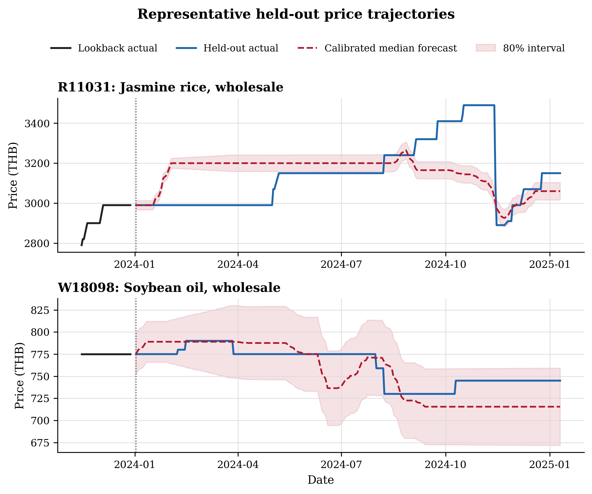
*Figure 7: Forecasts of the selected model for the earliest 2024 origin of four representative products. The black segment is the pre-2024 lookback, the blue segment is the held-out path, the dashed red path is the model's median forecast, and the band is the 80% interval.*

The panels show genuine model behavior rather than an idealized illustration, including its limitations. The median path is consistently smoother than the noisy daily actuals, and interval width scales sensibly with each product's typical volatility: narrow for the comparatively stable rice series, wider for soybean oil's step-like price changes, and moderate for the persistently noisy poultry series. Two further patterns deserve explicit comment. First, for jasmine rice the actual price embarks on a sustained multi-month rally that the median forecast largely fails to anticipate, staying close to a near-flat, persistence-like path instead; this is a concrete instance of the near-term weakness quantified in Table 7, and illustrates why a model trained on predominantly mean-reverting structure struggles when a sustained trend departs from that pattern. Second, this single illustrative origin does not always reproduce a product's full-period aggregate result. Broken jasmine rice was selected for its large *aggregate* one-year improvement (a 62% MAE reduction across all 2024–2025 test origins), yet at this particular origin the median forecast undershoots and the selected model is narrowly worse than persistence. We retain this example deliberately rather than selecting a more favorable origin for that product, since it illustrates an important caveat. Any single forecast path is one draw from the same noisy process documented in Section 5.2, and the properly aggregated evidence in Tables 7 through 9, rather than any individual illustration, should form the basis of assessment.

Figure 7 was deliberately built from extremes, the largest win and a genuine loss, so it cannot show what the model typically does. Figure 8 complements it with one product per commodity group (all nine groups with a computed normalizer-gap record in Section 4.8), each selected by a second pre-specified, non-cherry-picked rule: for every product we compute its full test-period aggregate relative MAE change against the matched baseline, averaged over all four horizons, and within each group we pick the product whose value is closest to that group's own median. Every panel is therefore a typical, not a best-case or worst-case, outcome for its group.

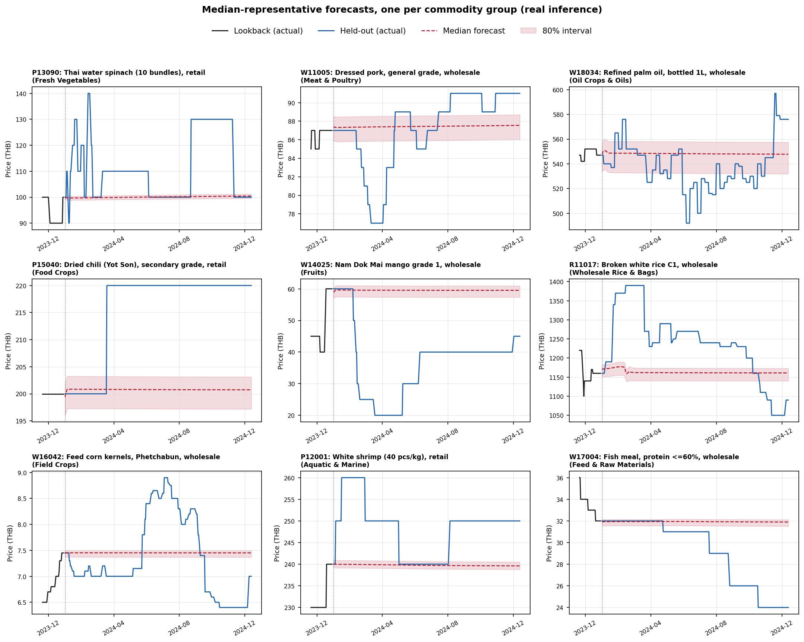
*Figure 8: Forecasts of the selected model for the earliest 2024 origin of one median-representative product per commodity group. Panel layout and conventions match Figure 7.*

The dominant pattern across Figure 8 is the same near-flat, persistence-like median forecast already noted for jasmine rice in Figure 7, now visible across a much wider slice of the dataset: in most panels the actual price wanders substantially within the year while the median stays close to its day-1 level, consistent with the near-term weakness quantified in Table 7 and the day-1 anchoring mechanism of Section 4.8. Interval width again scales sensibly with the underlying series, tight for administered or slow-moving products such as fish meal and dried chili, wide for volatile ones such as shrimp and palm oil. We caution against reading the per-panel outcomes as a win count: the selection rule targets each group's median on the *full* test-period aggregate across all four horizons, not on this single 2024 origin or on any one horizon, so a panel can look like a win or a loss at this particular origin while still representing its group's typical aggregate behavior. As with Figure 7, the aggregated evidence in Tables 7 through 9 is what should be trusted, and Figure 8 exists to make that typical behavior visible rather than to argue a point the tables do not already make.

<!-- supplement-only-end -->

## 6. Model Interpretability and Economic Insights

On held-out windows, the selected network's averaged attention places its largest weight on the oldest encoder step; historical variable selection is dominated by observed price, whereas static selection emphasizes group and product identity and decoder selection emphasizes day of week. Because encoder length is constant and attention/selection weights are associational diagnostics, these patterns should not be interpreted causally. Full plots, values, and caveats are reported in the Supplementary Material.

<!-- supplement-only-start -->

To elucidate the internal decision-making of the pooled TFT in a price-only setting, we extract and visualize self-attention and variable selection weights from the selected model ($\gamma = 4.5$) on a batch of test-period forecast windows.

### 6.1. Self-Attention Analysis

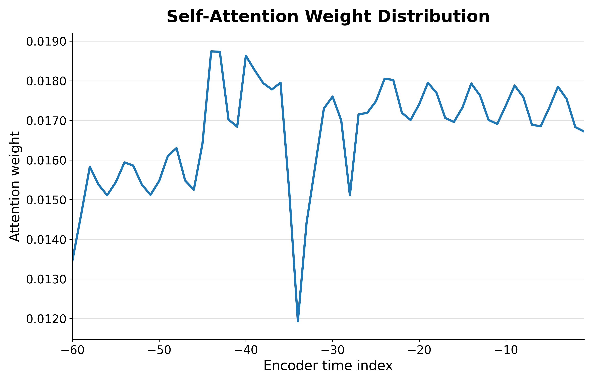
*Figure 9: Self-attention weight distribution across the historical encoder window (index 0 = oldest of the 30-day lookback, index 29 = most recent day before the forecast origin).*

Figure 9 shows a single dominant peak at the oldest step of the 30-day encoder window, approximately 3.4 times the weight of every other position, with attention essentially flat and low across the remaining 29 days, including the most recent observation. This is a different pattern from what an equally-weighted recency bias would predict, and is consistent with the selected model's steep horizon-weighted training objective (Section 4.6). A network optimized almost entirely for near-term decoder accuracy has comparatively little incentive to differentiate among encoder positions once it has anchored on the start of the lookback window, which under the pure-price design is the point furthest from, and therefore least correlated with, the noisy day-to-day fluctuations near the forecast origin.

### 6.2. Variable Selection and Feature Importance

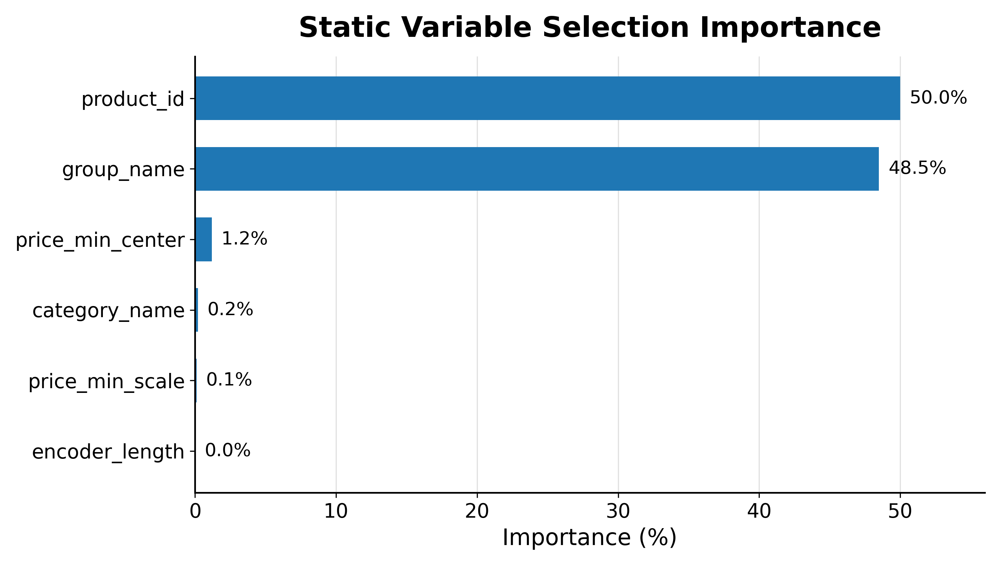
*Figure 10: Static variable selection importance scores.*

Figure 10 details the variable selection weights for static covariates: group identity is the largest single contributor (36.6%), followed by encoder length (30.6%), product identity (17.6%), the normalizer's price scale (8.2%), category identity (6.3%), and the normalizer's price center (0.8%). Group and product identity together account for 54.2% of static weight, supporting the parameter-pooling strategy. The model relies substantially on entity- and group-level structure to transfer learned dynamics across related crop series. The large weight on encoder length is a subtler finding that warrants explicit caution. Every training and evaluation window in this study uses a fixed 30-day encoder (Section 4.4), so this feature is constant-valued in our data and its high selection weight cannot reflect true sensitivity to varying history length; it more likely reflects the network absorbing a learnable, entity-independent bias term into a nominally static covariate, an artifact of the fixed-window design rather than a substantive economic signal.

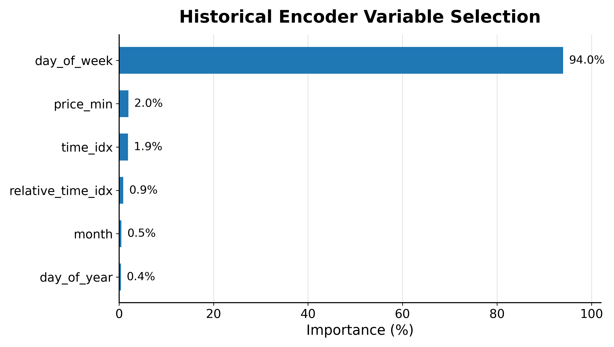
*Figure 11: Historical encoder variable selection importance scores.*

Figure 11 shows that the historical encoder relies almost entirely on the observed price itself (99.7%), with every calendar covariate (day of week, month, absolute time index, relative time index, day of year) contributing 0.14% or less. This provides the most direct confirmation that the encoder behaves as the pure-price design intends. Historical context derives from the price path, not from a calendar proxy, so the attention peak at the oldest encoder step in Figure 9 is a price-history effect rather than an artifact of a seasonal shortcut.

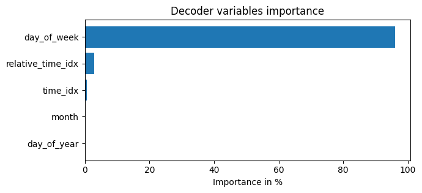
*Figure 12: Future decoder variable selection importance scores.*

Figure 12 shows a markedly different pattern for the future-known variables the decoder conditions on. The day-of-week signal carries 95.9% of decoder weight, versus 2.9% for the relative time index (the model's within-horizon position), 0.6% for the absolute time index, and negligible weight for month and day-of-year. Since the observed data is aligned to a Monday-to-Friday business-day skeleton (Section 3.2), day-of-week is the only future-known covariate that carries repeating market microstructure (e.g., weekly reporting and quotation cadence in the underlying market data), which plausibly explains the decoder's heavy reliance on it; it is also possible the network is using day-of-week as an easily learnable proxy for its position within the decoder sequence, since the two are correlated but not identical, a distinction the interpretability analysis cannot resolve on its own and that we note as a caveat rather than a definitive finding. Coarser seasonal coordinates (month, day-of-year) are effectively unused by the decoder despite the pronounced yearly cycles documented in Section 3.4, suggesting any macro-seasonal awareness the model has learned is encoded through the static entity embeddings and the LSTM's recurrent state rather than through the decoder's own known-future inputs.

<!-- supplement-only-end -->

## 7. Probabilistic Forecasting and Empirical Interval Calibration

Raw 80% prediction intervals produced by individual pooled TFTs are too narrow on this data. Empirical coverage across the seventeen seed-42 sweep members and four horizons ranges from 6.3% to 65.0% against the 80% nominal target, with many steep-decay configurations most severely affected. The validation-fitted conformal-style rescaling of Section 4.7 substantially improves realized coverage. Table 9 reports the scaled intervals of the selected model on the 2024–2025 test set.

#### Table 9: Validation-Scaled 80% Prediction Intervals of the Selected Model (Test Set)
| Horizon | Calibration scale $s_h$ | Interval width (THB) | Empirical coverage |
| :--- | :---: | :---: | :---: |
| $t+20$ | 7.32 | 131.47 | 83.1% |
| $t+60$ | 10.45 | 186.17 | 78.8% |
| $t+120$ | 13.18 | 216.96 | 77.6% |
| $t+250$ | 19.60 | 312.45 | 89.6% |

Post-scaling coverage reaches 77.6–89.6%, with interval widths increasing with horizon. The large fitted scales ($s_h \approx 7$–$20$) show that the raw $\gamma=4.5$ interval heads substantially understate dispersion in this experiment. Point-accuracy weighting and native interval learning are therefore empirically in tension in this setup, and the raw intervals should not be used operationally. Coverage at $t+20$ and $t+250$ is above nominal (83.1% and 89.6%), consistent with distribution change between the 2023 fitting year and the test period. These are marginal pooled coverages, not per-product or conditional guarantees; prospective rolling recalibration would need to be validated before deployment.

## 8. Conclusion

This study shows that a pooled Temporal Fusion Transformer trained with a Horizon-Weighted Quantile Loss can outperform persistence at six- and twelve-month horizons on Thai agricultural price data. The controlled seed-42 sweep demonstrates that reallocating a uniform 250-step objective changes the accuracy trade-off: the selected $\gamma=4.5$ run lowers $t+20$ MAE by 62% relative to the unweighted TFT, and the operating point is fixed by the held-out 2023 validation year. We do not claim to have measured or resolved gradient-vector conflict. On matched 2024–2025 windows across 404 crops, the selected run improves aggregate MAE by 12.0% (39.76 vs 45.21 THB), SMAPE by 0.7%, and RMSE by 15.1%. Its advantage is concentrated at $t+120$ (−10.3% MAE) and $t+250$ (−36.8%), while it underperforms at $t+20$ and wins on 57.7% of crops overall. The $t+20$, $t+120$, and $t+250$ differences survive Holm correction on both product-level tests; $t+60$ is not distinguishable from zero. All three $\gamma=4.5$ seeds beat persistence overall and at the two longer horizons. Seasonal-naive, drift, and the evaluated zero-shot Chronos-Bolt checkpoint also fail to outperform persistence overall. Validation-fitted interval scaling yields 77.6–89.6% empirical marginal coverage against the 80% target, without a formal conformal guarantee. A seven-model persistence-anchored variant reaches 36.04 THB and avoids horizon-level deterioration on this test set, but neither its fitted weights nor the selected model are guaranteed under future regime shifts.

The practical reading is more modest. Persistence remains the preferred forecast within a business quarter, whereas the pooled model becomes useful at longer horizons in this test period. The sweep also exposes a point-versus-interval trade-off: aggressive early-step weighting improves median accuracy but leaves the raw outer quantiles too narrow. The interpretability outputs show that this fitted network places high attention on the oldest encoder step, gives price history more encoder weight than calendar variables, and uses entity and group embeddings; these diagnostics describe model behavior rather than establish causal economic drivers.

### 8.1. Limitations and Future Directions

Several limitations qualify these results and motivate future work:
*   **Near-term deficit and cross-sectional coverage.** The selected model underperforms persistence at $t+20$ (+75.5% MAE) and $t+60$ (+9.5%) on the full test period, and outperforms the baseline on only 24.5% of crops at $t+20$ and 57.7% overall. These results set a demanding empirical benchmark for price-only forecasting, not a proven theoretical ceiling. The anchored variant eliminates the horizon-level deficit on this test set, but testing whether exogenous market covariates improve the near term remains open.
*   **Target-normalizer staleness.** The `GroupNormalizer` is fit once on 2018–2022 data and never refreshed (Section 4.8); a raw-price level-shift proxy exceeds 10% for 70.6% of products and is associated with worse relative performance at $t+20$ ($r=+0.146$, unadjusted $p=0.007$). The proxy is not the transformed internal center, and this exploratory correlation does not establish that normalization causes the deficit. A controlled refit or ablation is needed.
*   **Cross-product co-movement is too weak to exploit directly.** A lightweight linear proxy that augments each product's own history with its most correlated near-duplicate partner (mean correlation 0.998) improved MAE by only 0.03% on average. Together with the near-zero average return correlation in the supplementary diagnostics, this leaves limited evidence that an explicit cross-product architecture would improve on pooled static embeddings.
*   **Metric sensitivity.** The advantage holds on MAE, SMAPE, and RMSE, but the SMAPE margin is thin (−0.7% overall) and rests on the long horizons; applications scored primarily on percentage error at short horizons should not expect a gain.
*   **Training variance and selection granularity.** The seventeen exponents are compared under one common seed, after which only the selected exponent is repeated. Across seeds 42–44, overall MAE ranges from 39.76 to 43.70 THB; all three beat persistence overall and at $t+120$/$t+250$, but the exact point estimate is initialization-dependent. A fully crossed exponent-by-seed design would better quantify uncertainty in the location of the optimum.
*   **Adaptive design choices.** The grid extension and analysis design were iterated during development with access to test-period metrics. The final operating point follows a deterministic 2023-validation rule, and no test data enter fitted parameters, but this history can still induce researcher degrees of freedom in the reported study. The year-split and seed checks are sensitivity analyses, not substitutes for a pre-registered confirmation on post-2025 data.
*   **Significance-testing assumptions.** The product-level tests of Section 4.3 treat each crop's mean error differential as an independent observation. Near-zero average return correlation supports this approximation but does not remove dependence among near-duplicate series. Holm correction addresses the four horizon-wise comparisons, not cross-product dependence; a family-level cluster analysis or block bootstrap would be a useful robustness extension.
*   **Interval-calibration validity.** The interval scales reuse the 2023 validation year that informs training monitoring and exponent selection, and the overlapping time-series windows are not exchangeable. The reported 77.6–89.6% values are empirical pooled test coverage only, not finite-sample conformal, conditional, or per-product guarantees.
*   **Extensions.** Spatial-temporal relational modeling across geographical regions, hierarchical global-local routing, transfer learning from larger agricultural corpora, and rolling recalibration of interval scales in deployment are natural next steps.

---

## CRediT authorship contribution statement

**Kritaphat Songsri-in:** Conceptualization, Methodology, Software, Formal analysis, Writing – original draft. **Auyporn Chukeaw:** Data curation, Validation, Writing – review & editing. **Munlika Rattaphun:** Investigation, Validation, Writing – review & editing. **Walaiporn Sornkliang:** Data curation, Investigation, Writing – review & editing. **Rattayagon Thaiphan:** Supervision, Funding acquisition, Writing – review & editing.

## Declaration of competing interest

The authors declare that they have no known competing financial interests or personal relationships that could have appeared to influence the work reported in this paper.

## Funding

This research did not receive any specific grant from funding agencies in the public, commercial, or not-for-profit sectors.

## Data availability

The raw price data are publicly available from the Ministry of Commerce (Thailand), Department of Internal Trade, Open Data portal ("Agricultural Product Price" dataset, https://data.moc.go.th/OpenData/GISProductPrice; accessed 27 July 2026), which also exposes a REST API (https://dataapi.moc.go.th/gis-product-price) for retrieval by product ID and date range. All analysis code, the aggregate result files underlying every table and figure, and the scripts that regenerate the manuscript from them are publicly available at https://github.com/kritsong/thai_crop_price_prediction. The raw price files are not mirrored in that repository, since they remain the property of the Ministry of Commerce; the code reads them from a directory configured at runtime, so the pipeline runs against a fresh download from the portal above. Model checkpoints and per-window prediction files are omitted for size and are available from the corresponding author on reasonable request.

## Declaration of generative AI and AI-assisted technologies in the manuscript preparation process

During the preparation of this work, the authors used Claude (Anthropic) and Codex (OpenAI) to assist with drafting and revising manuscript text and implementing analysis code. All reported figures and tables were generated deterministically from the experimental data rather than with generative-image tools. After using these tools, the authors reviewed, verified, and edited the content as needed and take full responsibility for the content of the published article.

## References

[1] Box, G. E. P., & Jenkins, G. M. (1970). *Time series analysis: Forecasting and control*. Holden-Day.

[2] De Gooijer, J. G., & Hyndman, R. J. (2006). 25 years of time series forecasting. *International Journal of Forecasting*, 22(3), 443–473. https://doi.org/10.1016/j.ijforecast.2006.01.001

[3] Ke, G., Meng, Q., Finley, T., Wang, T., Chen, W., Ma, W., Ye, Q., & Liu, T.-Y. (2017). LightGBM: A highly efficient gradient boosting decision tree. In *Advances in Neural Information Processing Systems* (Vol. 30, pp. 3146–3154).

[4] Kaewchada, S., Ruang-On, S., Kuhapong, U., & Songsri-in, K. (2023). Random forest model for forecasting vegetable prices: A case study in Nakhon Si Thammarat Province, Thailand. *International Journal of Electrical and Computer Engineering (IJECE)*, 13(5), 5265–5272. https://doi.org/10.11591/ijece.v13i5.pp5265-5272

[5] Hochreiter, S., & Schmidhuber, J. (1997). Long short-term memory. *Neural Computation*, 9(8), 1735–1780. https://doi.org/10.1162/neco.1997.9.8.1735

[6] Vaswani, A., Shazeer, N., Parmar, N., Uszkoreit, J., Jones, L., Gomez, A. N., Kaiser, Ł., & Polosukhin, I. (2017). Attention is all you need. In *Advances in Neural Information Processing Systems* (Vol. 30, pp. 5998–6008).

[7] Lim, B., Arık, S. Ö., Loeff, N., & Pfister, T. (2021). Temporal fusion transformers for interpretable multi-horizon time series forecasting. *International Journal of Forecasting*, 37(4), 1748–1764. https://doi.org/10.1016/j.ijforecast.2021.03.012

[8] Nie, Y., Nguyen, N. H., Sinthong, P., & Kalagnanam, J. (2023). A time series is worth 64 words: Long-term forecasting with transformers. In *International Conference on Learning Representations (ICLR)*. https://openreview.net/forum?id=Jbdc0vTOcol

[9] Liu, Y., Hu, T., Zhang, H., Wu, H., Wang, S., Ma, L., & Long, M. (2024). iTransformer: Inverted transformers are effective for time series forecasting. In *International Conference on Learning Representations (ICLR)*. https://openreview.net/forum?id=JePfAI8fah

[10] Ansari, A. F., Stella, L., Türkmen, C., Zhang, X., Mercado, P., Shen, H., Shchur, O., Rangapuram, S. S., Arango, S. P., Kapoor, S., Zschiegner, J., Maddix, D. C., Wang, H., Mahoney, M. W., Torkkola, K., Wilson, A. G., Bohlke-Schneider, M., & Wang, Y. (2024). Chronos: Learning the language of time series. *Transactions on Machine Learning Research*. https://openreview.net/forum?id=gerNCVqqtR

[11] Bates, J. M., & Granger, C. W. J. (1969). The combination of forecasts. *Operational Research Quarterly*, 20(4), 451–468. https://doi.org/10.1057/jors.1969.103

[12] Makridakis, S., Spiliotis, E., & Assimakopoulos, V. (2020). The M4 Competition: 100,000 time series and 61 forecasting methods. *International Journal of Forecasting*, 36(1), 54–74. https://doi.org/10.1016/j.ijforecast.2019.04.014

[13] Lakshminarayanan, B., Pritzel, A., & Blundell, C. (2017). Simple and scalable predictive uncertainty estimation using deep ensembles. In *Advances in Neural Information Processing Systems* (Vol. 30, pp. 6402–6413).

[14] Romano, Y., Patterson, E., & Candès, E. J. (2019). Conformalized quantile regression. In *Advances in Neural Information Processing Systems* (Vol. 32, pp. 3543–3553). https://proceedings.neurips.cc/paper/2019/hash/5103c3584b063c431bd1268e9b5e76fb-Abstract.html

[15] Ministry of Commerce (Thailand), Department of Internal Trade. (2026). *Agricultural product price* [Data set]. MOC Open Data. https://data.moc.go.th/OpenData/GISProductPrice (accessed 27 July 2026).

[16] Hyndman, R. J., & Athanasopoulos, G. (2021). *Forecasting: Principles and practice* (3rd ed.). OTexts. https://otexts.com/fpp3/

[17] Diebold, F. X., & Mariano, R. S. (1995). Comparing predictive accuracy. *Journal of Business & Economic Statistics*, 13(3), 253–263. https://doi.org/10.1080/07350015.1995.10524599

[18] Lin, T.-Y., Goyal, P., Girshick, R., He, K., & Dollár, P. (2017). Focal loss for dense object detection. In *Proceedings of the IEEE International Conference on Computer Vision (ICCV)* (pp. 2980–2988). https://openaccess.thecvf.com/content_iccv_2017/html/Lin_Focal_Loss_for_ICCV_2017_paper.html

[19] Chen, Z., Badrinarayanan, V., Lee, C.-Y., & Rabinovich, A. (2018). GradNorm: Gradient normalization for adaptive loss balancing in deep multitask networks. In *Proceedings of the 35th International Conference on Machine Learning* (Vol. 80, pp. 794–803). PMLR. https://proceedings.mlr.press/v80/chen18a.html
